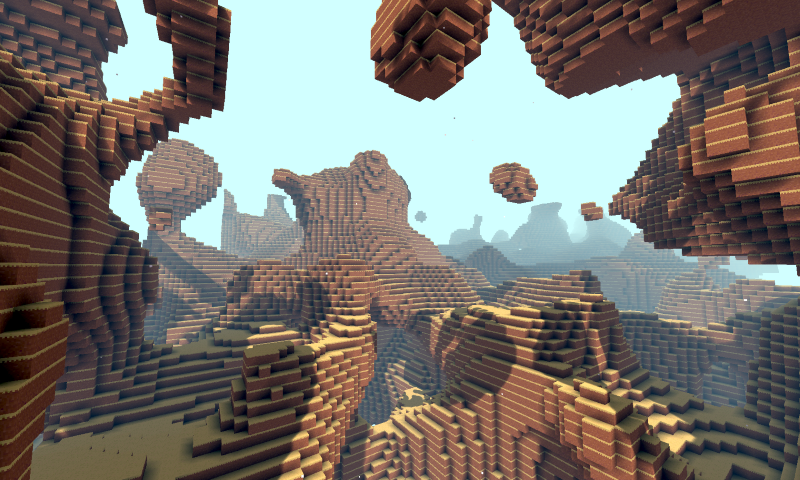

# Godot Voxel中文文档【翻译项目】

## 概述

Godot Voxel是一个基于Godot编辑器构建的3D地形生成工具，可以用于生成或平滑或体素风格的三维随机地形，并且可以在地形上生成可以参数化控制的多网格实例和带碰撞的场景，从而可以方便的构建草地、树木等自然植被以及石头等物体的随机分布，从而构建出生动和复杂的三维地形和场景。

并且这一切都是基于流和LOD技术：

- 流技术：用于保存整个场景的数据，并以块的形式动态读取地图的一部分。
- LOD技术：根据玩家的距离远近，地形和实例化的细节将不同，越远的细节越少，越近的细节越好。并且它们将根据玩家的移动动态的加载和删除，从而减轻游戏运行时的内存和压力。

---

**注意**

Godot Voxel本质是一个基于Godot源码开发的C++模块，以单独的Godot版本编译和构建，所以本质上它并不是一个Godot插件，而是一个独立的Godot版本。

官方虽然提供了文档，但是没有提供中文版本，所以译者([Bilibili@巽星石](https://space.bilibili.com/98273681))想着完整翻译一遍。但是由于原文档内容组织还是有些问题，所以我还是决定对部分内容以自己的方式重新组织语言和排版，让其更适合中国Godoter们的体质。

---

## 文档目录

- [下载安装](./主文档/下载安装.md) |[快速上手](./主文档/快速上手.md) | [学习资源](./主文档/学习资源.md) |[体素相关概念](./主文档/体素相关概念.md) |[在编辑器中的使用](./主文档/在编辑器中的使用.md)
- [地形类型](./主文档/地形类型.md) |[块状地形](./主文档/块状地形.md) |[平滑地形](./主文档/平滑地形.md) 
- [生成器](./主文档/生成器.md) | [VoxelGeneratorGraph节点](./主文档/VoxelGeneratorGraph节点.md) | [VoxelGeneratorGraph详细使用](./主文档/VoxelGeneratorGraph详细使用.md) | [使用脚本创建和修改体素数据](主文档\使用脚本创建和修改体素数据.md) 
- [流](./主文档/流.md) 
- [基于VoxelInstancer的实例化](./主文档/基于VoxelInstancer的实例化.md) | [程序化生成](./主文档/程序化生成.md) 
-  [创建多人游戏](./主文档/创建多人游戏.md) 
-  [参与Goodot Voxel模块开发](./主文档/参与Goodot Voxel模块开发.md) 

- [API文档](./API/API文档.md) 
