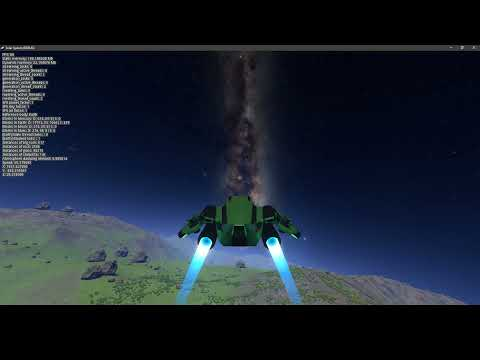
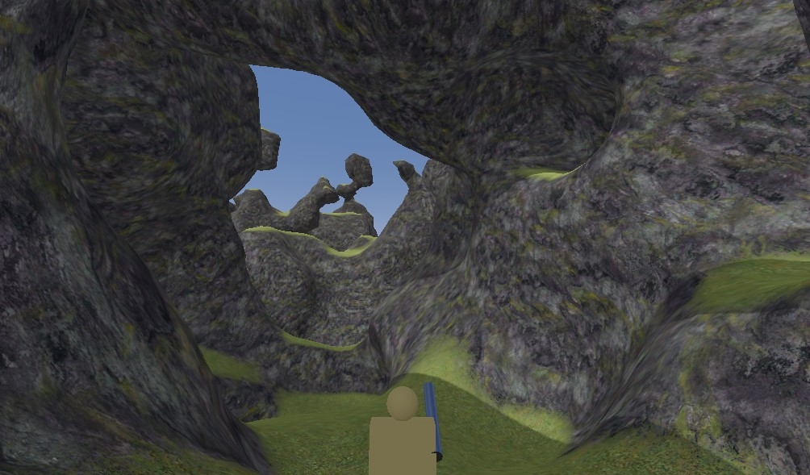

# Godot voxel中文文档【翻译项目】

## 概述

Godot Voxel是一个基于Godot编辑器构建的体素游戏开发工具，它以C++模块的形式开发，并以单独的Godot版本编译和构建，所以本质上它并不是一个Godot插件，而是一个独立的Godot版本。

通过它你可以快速的上手开发类我的世界的体素游戏，其最主要的核心当然是辅助创建体素网格。经过实际的体验，其算法生成网格的速度以及实际场景中显示效率都相当不错。

官方虽然提供了文档，但是没有提供中文版本，所以译者([Bilibili@巽星石](https://space.bilibili.com/98273681))想着完整翻译一遍。但是基于原文档写的比较简单，所以我还是决定以自己的方式重新组织语言和排版，让其更适合中国Godoter们的体质。

### Godot Voxel项目

- GitHub仓库：https://github.com/Zylann/godot_voxel

### 相关教程

- [【Godot教程】用 Godot制作《我的世界》风格的游戏！_哔哩哔哩_bilibili](https://www.bilibili.com/video/BV1mN411J7yv/?spm_id_from=333.337.search-card.all.click)
- 使用平滑透体素方法的戈多体素工具模块的体素地形教程（由 Aknakos 提供）（2021 年 6 月 17 日）
- 如何在戈多制作体素地形（Tokisan Games）（2019年11月4日）
- 戈多体素工具（由游戏从零开始）（2020年7月25日）

###  演示项目

现在您的Godot引擎内置了体素支持，您可以下载其中一个演示并开始试用它们：

- [体素游戏演示（戈多引擎 4.0）](https://github.com/Zylann/voxelgame#voxel-game-demos-godot-engine-40)：基于Godot Voxel程序生成的体素地形和其他模型网格，基本上实现了《我的世界》的很多功能。

- 3D太空游戏演示：基于Godot Voxel程序生成星球。Youtube[演示视频](https://www.youtube.com/watch?v=8OrZX347MoE)，整体感觉有点像《无人深空》低配版。

  

- [Godot体素工具的演示集合](https://github.com/tinmanjuggernaut/voxelgame)：包含基于Godot Voxel的多个演示。

  

## 详细教程

- [下载安装.md](主文档\下载安装.md) 
