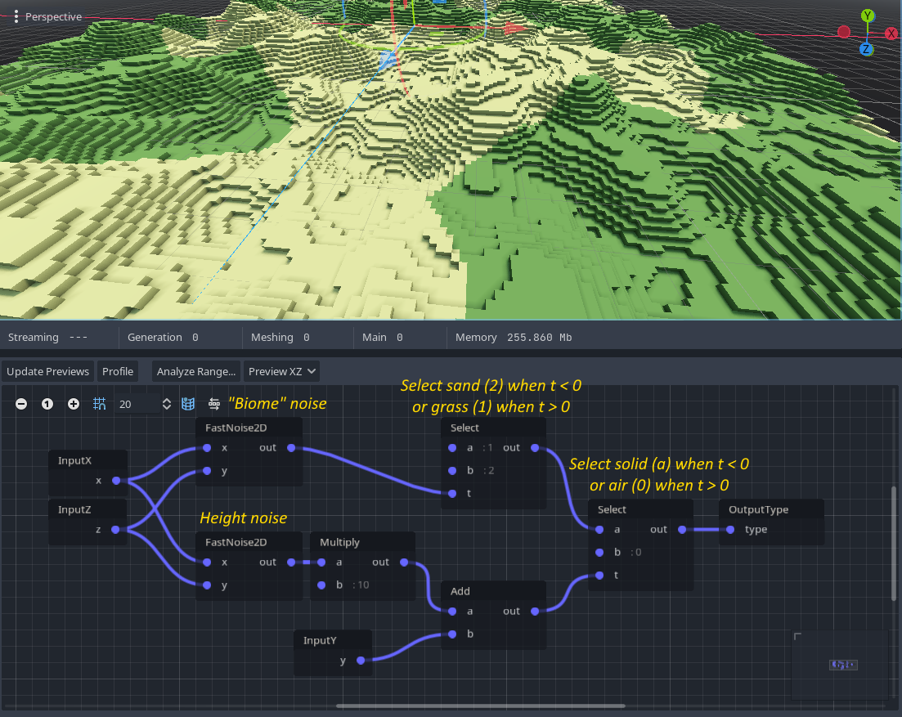
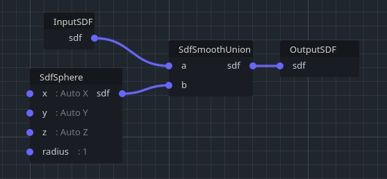

# VoxelGeneratorGraph详细使用

###  概念

VoxelGeneratorGraph允许通过将操作节点连接在一起来表示 3D 密度。它采用 3D 坐标（X、Y、Z），并从中计算每个体素的值。例如，它可以做一个简单的2D或3D噪声，可以使用其他噪声，曲线甚至图像进行缩放，变形，掩盖。

这种方法的一大灵感再次来自有符号距离场的雕刻（每个体素存储到最近表面的距离），这就是为什么主输出节点可能是. `SdfOutput` 一堆节点也应该在SDF上工作。但是，只要结果对于游戏来说看起来是正确的，就不必严格尊重完美距离，因此大多数时候使用近似值更容易。

 注意

体素图介于编程 3D 着色器和程序设计之间。它的速度与C++发电机相似，但只有基本指令，因此涉及一些数学。将来添加更多高级节点时，这可能会有所缓解。

###  示例

####  平面

具有可见输出的最简单图形是平面。平面的 SDF 是到海平面的距离 （0），即 `sdf = y` 。换句话说，表面将显示在体素值与零交叉的位置。

右键单击图形的背景，选择节点 `InputY` 和 `SdfOutput` ，然后通过将它们的端口拖在一起将它们连接在一起。

可以通过减去一个常数 （ `sdf = y - height` ） 来确定平面的高度，这样就会 `sdf == 0` 在更高的坐标处发生。为此，必须添加一个额外的节点：

默认情况下， `Add` 节点不执行任何操作，因为它的 `b` 端口未连接到任何端口。可以为此类端口提供默认值。您可以通过单击节点并在检查器中进行更改来设置它。

（注意：我使用了 `Add` 负值 `b` ，但您也可以使用 `Subtract` 节点来获得相同的结果）。

####  噪音 ¶

平面很简单，但有点无聊，因此生成地形的一种典型方法是添加良好的旧分形噪声。您可以在 2D（高度贴图）或 3D（体积）中执行此操作。2D方法更简单，因为我们只需要采用以前的设置，并在结果中添加2D噪声。此外，由于噪声是在 \[-1 到 1\] 范围内产生的，我们还需要一个乘数来使其更大 （ `sdf = y - height + noise2d(x, y) * noise_multiplier` ）。

有几种类型的噪声可用，每种都有自己的参数。在撰写本文时， `FastNoise2D` 噪音是最佳选择。 `Noise2D` 也可以工作，但它更慢，更有限（它使用戈多 `OpenSimplexNoise` 的类）。

 注意

创建此节点后，必须在其参数中创建新 `FastNoiseLite` 资源。如果未设置该资源，则会发生错误，并且不会生成体素。

3D噪声的计算成本更高，但很有趣，因为它实际上会产生悬垂甚至小洞穴。在以前的设置中，可以用 3D 噪声替换 2D 噪声：

您可能会注意到，尽管它是 3D 的，但它似乎仍然会产生高度图。这是因为在图表 `Y` 中添加的噪声值在朝向天空时会逐渐抵消到越来越高的值，这使得表面迅速消失。因此，如果我们 `Y` 乘以较小的值，它将增加得更慢，从而使 3D 噪声扩展得更多 （ `sdf = y * height_multiplier - height + noise3d(x, y, z)` ）：

 注意

某些节点具有默认连接。例如，对于 3D 噪声，如果不连接输入，默认情况下它们将自动采用 （X，Y，Z） 体素位置。如果需要输入中的特定常量，可以通过在检查器中关闭 `autoconnect_default_inputs` 来选择退出此行为。

####  星球 ¶

我们实际上并没有被迫像飞机一样不断创造世界。我们可以更疯狂，做行星。开始一个行星的一个好方法是用 `SdfSphere` 节点做一个球体：

我们在这里不能真正使用 2D 噪声，因此我们也可以添加 3D 噪声：

但是，您可能仍然想要类似高度图的结果。一种方法是输入 3D 噪声归一化坐标，而不是全局噪声归一化坐标。选择脊状分形也可以给出侵蚀的外观，尽管它需要否定噪声乘数节点以反转其距离场（如果我们将其保留为正值，它将看起来膨胀而不是侵蚀）。

 注意

如果将节点替换为 `SdfSphere` `SdfTorus` 节点，则可以获得甜甜圈形状的行星。  

更多技术可以在过程生成部分找到。

###   

块状体素的使用 ¶

可以通过使用 `OutputType` 节点而不是 `OutputSDF` 来使用此生成器。 `VoxelMesherBlocky` 但是，期望体素是 ID， `VoxelMesherBlocky` 而不是 SDF 值。

最简单的示例是选取任何现有的 SDF 生成器，并替换为 `OutputSDF` `Select` 连接到 `OutputType` .这个想法是在 SDF 值高于或低于阈值时，在两种不同体素类型（如空气或石头）的 ID 之间进行选择。

如果需要更多种类，可以将节点链接起来， `Select` 使用不同的阈值和源组合多个层。

`Select` 在两个可能的值之间创建一个“切口”，并且可能需要进行某种过渡。虽然对于渐变的每个值没有很多不同的类型（通常使用着色器完成），这是不可能的 `VoxelMesherBlocky` ，但是很容易在阈值中添加一些噪声。这再现了类似的“抖动”过渡，正如在《我的世界》中沙子和泥土之间所看到的那样。

目前，图形生成器仅按体素工作。这使得它们非常适合生成基础地面和生物群落，但用它生成树木或村庄等结构是不切实际的。使用自定义生成器在整个块上使用第二次传递可能更容易实现。

###  继电器 ¶

存在一个特殊 `Relay` 节点来组织节点之间的长连接。他们自己什么都不做，他们只是重定向连接。中继也可能有多个目的地。

##  自定义生成器 ¶

 请参阅脚本

##   

用作 `VoxelGeneratorGraph` 画笔 ¶

此功能目前仅在平滑体素中 `VoxelLodTerrain` 受支持。

`VoxelTool` 例如，提供了修改平滑地形 `do_sphere` 的简单功能，但也可以使用 `VoxelGeneratorGraph` 定义程序自定义画笔。相同的工作流程也适用于制作这样的图形，只是它可以接受节点 `InputSDF` ，因此可以修改带符号的距离字段，而不仅仅是生成。

使用图形重新创建的添加剂 `do_sphere` 示例：

更复杂的扁平画笔，既减去球体中的物质，又增加半球中的物质以形成壁架（此处默认半径为 30 以获得更好的预览，但制作单位大小的画笔可能更容易重复使用）：

另一个需要考虑的细节是原始画笔有多大。通常体素生成器没有特定的界限，但在这里很重要，因为它将在本地使用。例如，如果您制作一个球形画笔，则可以使用 `SdfSphere` 半径 `1` 为 .然后，您的原始大小将是 `(2,2,2)` .然后，您可以在所需位置使用 `do_graph` 时变换该画笔（缩放、旋转...）。

##   

可重复使用的图形与 `VoxelGraphFunction` ¶

`VoxelGraphFunction` 允许创建可以在其他图形中使用的图形。这是重用和共享图形的便捷方法。

###  创建函数 ¶

A `VoxelGraphFunction` 可以在检查器中创建并像 一样 `VoxelGeneratorGraph` 进行编辑，只是它缺少一些仅在后者上找到的功能。建议将函数保存为自己的 `.tres` 文件，因为这是允许在其他图形中拾取它们的原因。

 注意

A `VoxelGraphFunction` 不能直接或间接地包含自身。这样做将导致戈多无法加载它。

###   

公开输入和输出 ¶

为了可以在其他图形中使用，函数应该有输入和输出。可以通过创建节点 `InputX` 、 `InputY` `InputZ` 、 `InputSDF` 或 `CustomInput` 来将输入添加到函数中。可以通过创建节点 `OutputX` 、、 `OutputZ` 、 `OutputY` 等 `CustomOutput` 来添加输出。

但是，需要额外的步骤才能向函数的外部用户公开这些输入和输出。要显示它们，请选择图形（如果已打开，则在后台单击），转到检查器，然后单击 `Edit input/outputs` 。

目前，不支持定义手动公开的输入和输出，但已计划。您可以改为单击 `Auto-generate` ，这将自动找到节点并将它们公开为输入和输出。这也定义了它们的公开顺序。

非自定义输入和输出（如 `InputX` or `OutputX` ）是特殊节点，由其类型标识。它们被引擎识别用于特定目的。您可以有多个具有相同类型的节点，但它们将始终引用函数的相同输入。

自定义输入和输出由其名称标识。如果添加 2 个 `CustomInput` 节点并为其指定相同的名称，它们将从相同的输入中获取数据。建议为自定义输入和输出节点命名。空名称仍算作一个名称（因此多个 `CustomInput` 没有名称的名称将引用相同的未命名输入）。

不允许多个特殊输入或相同类型的输入。不允许使用多个自定义输入或同名输出。

###  公开参数 ¶

目前参数无法公开，但已计划。

###  处理更改 ¶

当现有函数发生变化（例如，新的/删除的输入/输出）时，使用它的其他图形可能会中断。如果尝试打开它们，则可能会丢失某些节点和连接。

目前，您需要修复这些图形并保存它们。您还可以更改有问题的函数，使其输入、输出和参数符合您的期望。但是，如果保存损坏的图形，则可能会丢失某些连接或节点。

###  调试 ¶

编辑器工具（如性能分析、输出预览或范围分析）目前在 中 `VoxelGraphFunction` 不受支持。编辑 `VoxelGeneratorGraph` .

计划在将来编辑独立文件 `VoxelGraphFunction` 时提供这些工具。这将通过将功能移出 `VoxelGeneratorGraph` 以使其变得更加通用来完成。

检查函数“实例”（和子实例...）可能是可取的，但实现起来很棘手。它可以作为“内部开放”功能来完成，以检查“包含图”上下文中的数据。但是，由于函数在内部完全解包和优化，因此引擎必须将信息追溯到原始节点。跟踪在某种程度上已经存在，但仅将“顶级”图映射到完全扩展/优化的图，没有中间信息。将来可能会进一步研究这个问题。

###   

体素生成器图节点 ¶

可以在此处找到节点的完整列表。

##  修饰符 ¶

修饰符是影响体积有限区域的生成器。它们可以堆叠在基本生成的体素或其他修饰符之上，并影响最终结果。当您的世界大小有限，并且您希望从编辑器中以非破坏性方式设置特定的景观形状时，这是一个工作流程。

 注意

此功能目前仅通过 实现 `VoxelLodTerrain` ，并且仅适用于雕刻平滑体素。它处于早期阶段，因此非常有限。

可以将修改器与节点一起添加为地形的子项。 `VoxelModifierSphere` 添加或减去球体，同时 `VoxelModifierMesh` 添加或减去网格。对于后者，必须首先使用 `VoxelMeshSDF` 资源将网格烘焙到 SDF 体积中。

由于修饰符是程序生成堆栈的一部分，因此破坏性编辑将始终覆盖它们。如果编辑了块，则修饰符不会影响它。然后假设此类编辑将在运行时来自玩家，并且修饰符不会更改。

##  缓存 ¶

生成器被设计为确定性的：如果同一区域生成两次，则结果必须相同。这意味着，最终，我们只需要存储编辑的体素（又名“破坏性”编辑），而未编辑的区域可以动态重新计算。即使您想要访问一个体素并且它恰好位于未编辑的位置，也会调用生成器以获取该体素。

但是，如果生成器太昂贵或预计不会以这种方式运行，则可能需要将输出存储在内存中，以便再次查询同一区域以获取缓存的数据。

默认情况下，将块缓存在内存中， `VoxelTerrain` 直到它们远离任何查看器。 `VoxelLodTerrain` 默认情况下不缓存块。目前还没有改变这种行为的选项。也可以告诉 a `VoxelGenerator` 将其输出保存到当前 `VoxelStream` ，如果有的话。但是，这些块将充当编辑过的块，因此它们的行为就像是破坏性的更改一样。