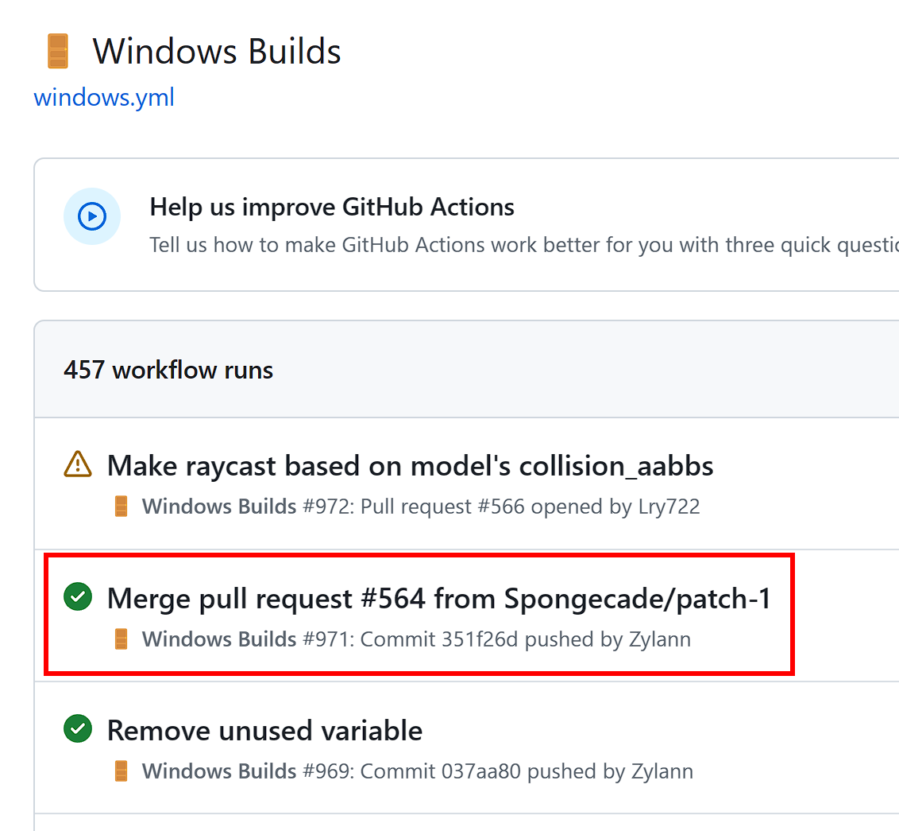
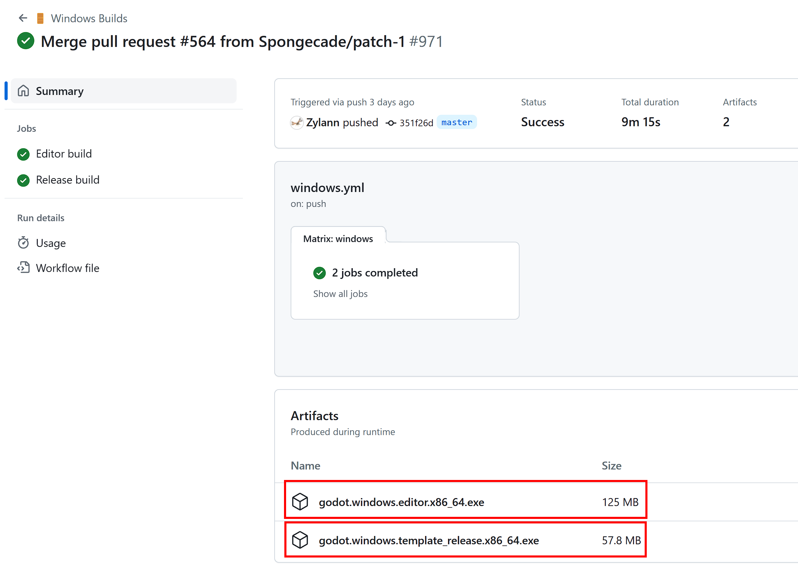
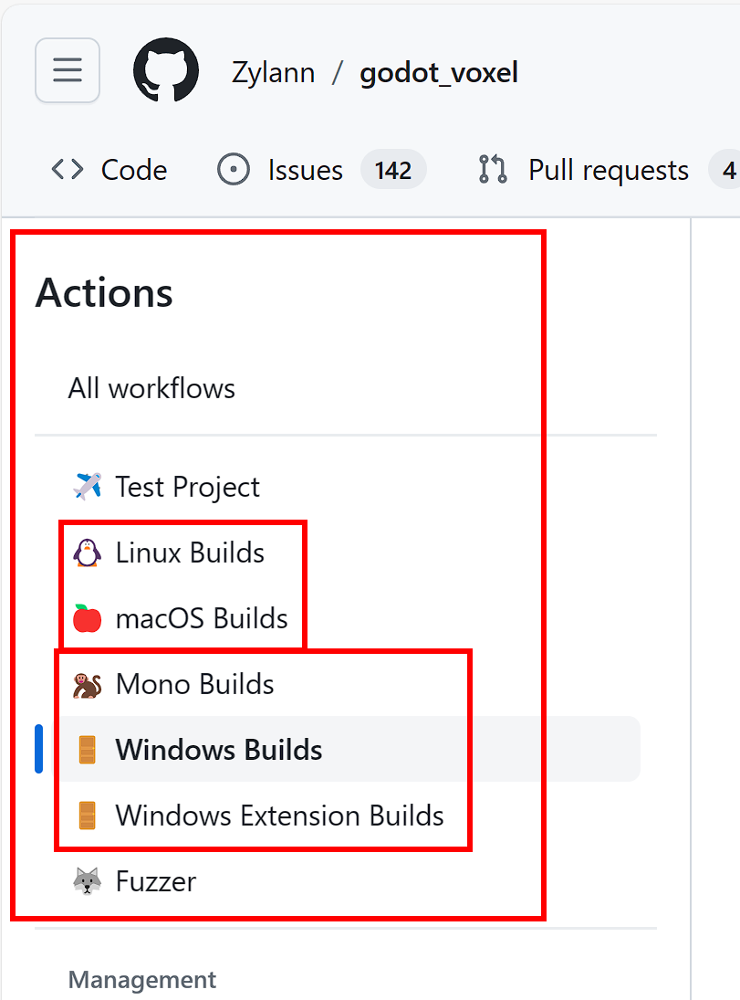
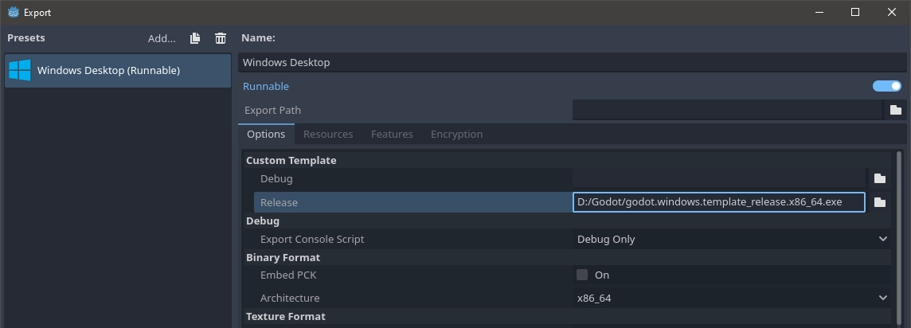
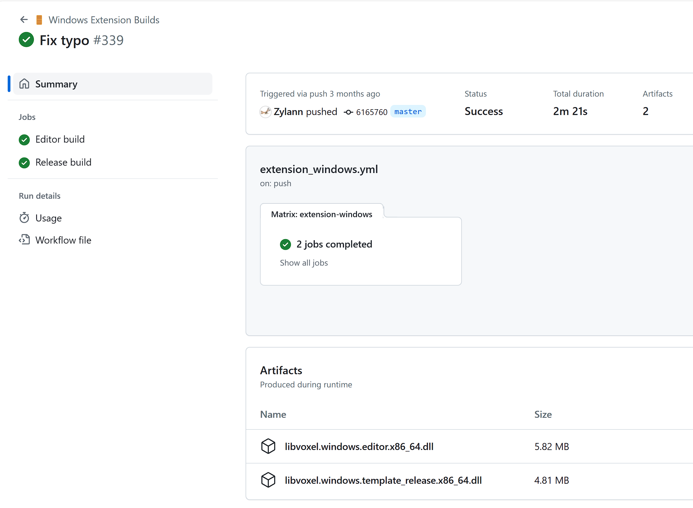

# 下载安装

点击下面的链接，进入项目的Gothub Actions页面，选择最近一次的成功构建版本。

- [Windows 构建](https://github.com/Zylann/godot_voxel/actions/workflows/windows.yml)

点击下载底部的editor和template安装程序。

你也可以在Actions页面的左侧，点击其他平台的构建。

注意：

目前Godot Voxel已经是基于Godot4.1版本构建的。下载Godot Voxel相当于你下载了一个特殊的Godot4.x版本。

Godot自己编译的版本需要搭配自定义导出模板一起使用。

## GDExtension版本

项目官方，也在致力于构建Godot Voxel的GDExtension版本，到时候就不需要再下载独立的Godot的版本，而可以以插件形式直接在Godot的资产库中下载和安装、使用。

同样你可以在项目的Github Actions页面[Windows Extension Builds](https://github.com/Zylann/godot_voxel/actions/workflows/extension_windows.yml)子类中查找最新成功的构建版本。

