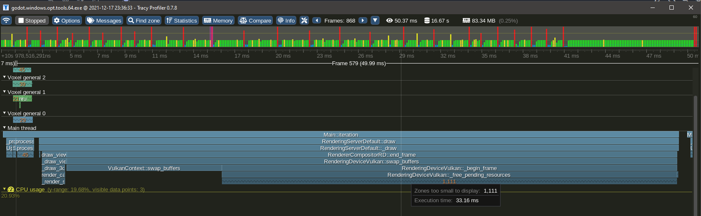
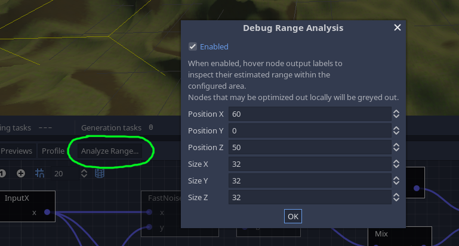
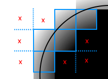
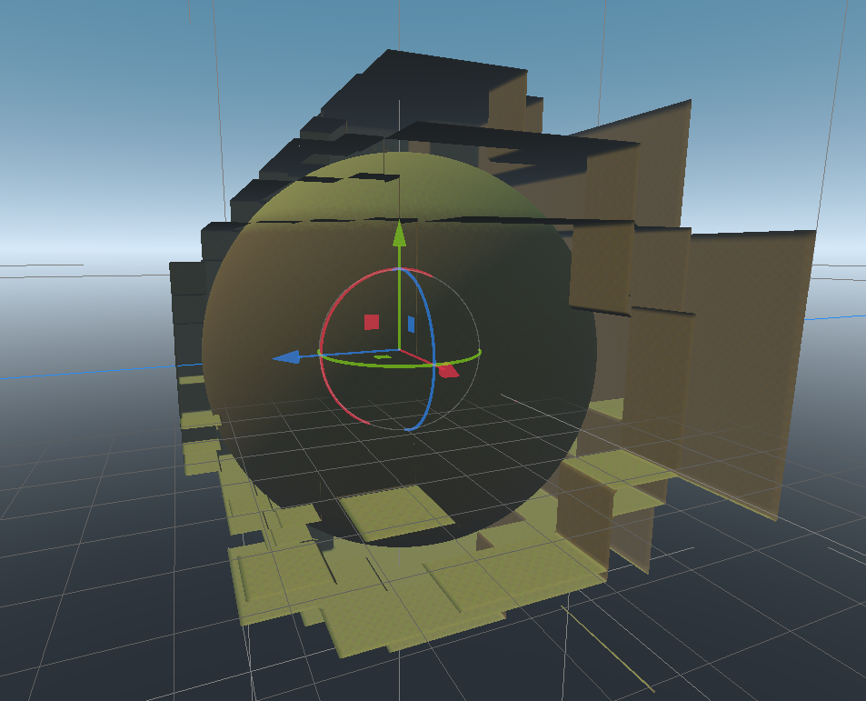

# 优化性能

本节讨论与性能相关的主题，例如使体素引擎快速运行。它可能比其他部分更具技术性。

##  线程

###  线程计数


该模块使用线程来加快繁重的操作并避免停顿。


根据 CPU 可以同时运行的线程数，最佳线程数可能会有所不同。对于运行游戏的玩家，这也可能会有所不同。该模块根据 CPU 支持的并发线程数自动确定运行时要使用的线程数。


您可以在项目设置的 `Voxel` 部分中更改分配的线程数。自动计算将基于以下属性：

|  参数名称 |  类型 |  描述 |
| --- | --- | --- |
| `voxel/threads/count/minimum` | `int` | 最小线程数 |
| `voxel/threads/count/margin_below_maximum` | `int` | 低于最大并发计数的线程数应视为最大值。 `0` 表示最大并发计数将是最大值。 `1` 表示最大并发计数减 1 将是最大值。 |
| `voxel/threads/count/ratio_over_maximum` | `float` | 尝试使用的最大并发线程数的一部分，介于 0 和 1 之间。例如， `0.5` 将尝试使用其中的一半。结果将使用其他选项进行钳制。 |

 几点说明：

-     
    建议不要将所有可用的线程用于体素内容。游戏更多地用于其他事情，玩家甚至可以在后台执行其他操作（例如音乐，YouTube播放列表或语音聊天）。
-     
    不能使用零线程。该模块目前设计为使用线程。
-     
    您可以在运行时检查使用脚本并使用 分配了多少头 `VoxelEngine.get_stats()` 头。如果在项目设置（或在 `-v` 命令行）中启用，也会 `debug/settings/stdout/verbose_stdout` 打印它。
-     
    更改这些设置需要编辑器重新启动（或游戏重新启动）才能生效。

###  主线程超时


有些任务仍然必须在主线程上运行，如果我们要添加所有必须处理的剩余内容，有时它们的总时间可能会超过一帧的持续时间。


为了缓解这种情况，模块可以选择停止处理这些任务超过一定的毫秒量，并在下一帧继续处理它们。在 中 `ProjectSettings` 查找 `voxel/threads/main/time_budget_ms` 。

##  渲染


地形使用许多独特的网格进行渲染。这相当于大量的绘制调用，并需要引擎剔除。可以通过多种方式减少块的数量：

-    缩短视距
-     
    减小 LOD 距离（如果使用 `VoxelLodTerrain` ）
-     
    增加网格块大小：它们默认为 16，但可以设置为 32。这将减少绘制调用的数量，但可能会增加修改体素所需的时间。

##  OpenGL 的网格更新速度慢问题
###  问题


Godot 3.x正在使用OpenGL，并且存在一个问题，该问题目前会大大降低此体素引擎的性能。帧率不一定不好，但体素地形的更新速度与应有的速度相比非常低。到目前为止，该问题已在Windows，英特尔或nVidia卡上出现。


注意：Godot 4.x 将有一个 OpenGL 渲染器，但此问题尚未在此处进行测试。

###  解决方法


注意：您不必一次完成所有操作，仅选择其中之一可以改善这种情况。

-     
    增加到 `voxel/threads/main/time_budget_ms` 高于帧时间的值（默认情况下约为 8 毫秒，即帧的一半）。但是，这可能会在更新网格时减慢 FPS。
-     
    或者在项目设置 `debug/settings/stdout/verbose_stdout` 中打开。这在内部启用了 OpenGL 调试扩展，由于某种原因，该扩展修复了 OpenGL 调用的预期计时。这是关于帧速率的最有效修复，但也有缺点，因为它打印很多，并且旨在作为调试功能。
-     
    或在项目设置中关闭 `display/window/vsync/use_vsync` 。效果不佳，消耗更多资源，但提高了性能。
-     
    或者在项目设置 `display/window/vsync/vsync_via_compositor` 中打开。效果不佳，但可以提高窗口模式下的性能。

###  解释


该引擎在很大程度上依赖于在运行时上传许多网格，到目前为止，这在Godot 3.x中无法有效地线程化。因此，网格在主线程中上传，直到部分帧时间过去。超过该时间，引擎将停止并继续下一帧。这是为了平滑负载并避免由任务 CPU 端引起的卡顿。其他无法线程化的任务也会放入同一队列中，例如创建碰撞体。


不幸的是，在帧期间对OpenGL的第一次调用似乎在CPU上花费了惊人的15毫秒。无论呼叫有多重，都会发生这种情况。体素引擎检测到这一点，并立即停止上传网格，认为它做得太多了。因此，通常每帧最终只上传一个网格，这太低了。我们可以取消时间限制，但如果它继续运行任务，它会由于超过帧的 16 毫秒限制而开始卡顿。


当使用一种解决方法（例如启用 `verbose_stdout` ）时，这种减速将完全消失。相反，“延迟”在帧的末尾移动。这已链接到打开的调试 OpenGL 扩展。有关更多信息，请参阅 Godot 问题 #52801。

##  使用 Vulkan 快速移动时速度减慢
###  问题


如果在具有大量块（网格大小为 16 和高 LOD 细节）的地形附近快速移动，渲染器可能会导致明显的减速。这是因为Godot4的Vulkan分配器破坏网格缓冲区的速度比Godot 3慢得多，而且它在主线程上这样做。当您快速移动时，会在摄像机前创建许多网格体，同时会在摄像机后面破坏很多网格体。创造是廉价的，破坏是昂贵的。


这是通过在 `release_debug` 构建中使用 Tracy 进行分析（用于官方优化构建的典型模式）观察到的：




在帧结束时，主线程上会释放大量缓冲区，这可能需要一段时间，从而导致 CPU 峰值。另一方面，当分配相同数量的网格时，不存在这样的问题。这个问题在戈多3中也不明显。


当许多小网格被破坏（小如 16x16 地形，大小可变）时，这个问题会特别重现，而其中很多（数千个）已经同时存在。请注意，其中一些不一定可见。

###  解决方法


模块不可能只是“池化网格”，因为当需要创建新网格时，API 无论如何都需要创建新的缓冲区并删除旧缓冲区 （AFAIK）。也不可能在我们这边使用线程，因为工作被推迟到框架的末尾，而不是在调用站点上。


已采取缓解措施，通过随着时间的推移分散破坏的网格数量来平滑峰值，但速度仍然明显。


唯一的解决方法是限制游戏：

-     
    将网格块大小增加到 32 个以减少其数量，但代价是版本成本
-     
    限制玩家在接近体素时可以移动的速度
-     
    减小 LOD 距离，从而减少需要破坏的块，但会牺牲质量

##  访问体素


本节更详细地介绍如何使用体素存储实现多线程，以及访问和修改体素时的含义。

###  问题


在模块版本 `godot3.2.3` 之前，读取和写入体素并不关心多线程。可以在不锁定的情况下访问它们，因为使用它们的所有线程操作（保存和网格划分）都获得了在主线程上创建的体素副本。


这使事情变得简单，但是它会导致几个问题。

-     
    如果线程无法以比发出任务更快的速度消耗任务，则体素数据的副本将继续快速累积，并使游戏耗尽内存。
-     
    复制块及其邻居需要时间，并且可能会浪费，因为它不能保证被使用。
-     
    它假设线程任务只需要访问固定LOD的特定块，而在其他体素引擎（例如Phyronnaz的UE4体素插件）中并不总是如此。例如，在大块上运行的Transvoxel可能会尝试访问更高分辨率的块以更好地近似等值面，这在当前方法中是不可能的。

###  内部更改 ¶


旧设计开始在版本中 `godot3.2.4` 发生变化.副本不再在主线程上抢占式制作，而是在实际的线程任务中完成。这意味着访问体素现在需要在每次事务期间锁定数据，以确保每个线程获得一致的数据。如果访问属于多线程体积一部分的体素（如场景树中存在的地形），则需要锁定。如果您知道数据未被任何其他线程使用，例如内部生成器、自定义流、已知副本或不属于体素引擎活动组件的其他存储，则无需这样做。

#### RWLocks per VoxelBuffer


锁定策略最初是通过 `RWLock` 在每个 . `VoxelBuffer` 此类锁是读写锁，也称为共享互斥锁。


这种方法虽然简单，但意味着如果您有一个包含体素的 16x16x16 加载地形区域，则必须 `RWLocks` 从系统中分配 4,096 个，并在需要访问某个区域时将它们全部锁定。例如，更新网格意味着访问一个块及其 26 个邻居，即 27 个锁。它们还必须按特定顺序锁定，因为两个线程试图以不同的顺序锁定多个块会导致死锁，从而冻结游戏。 `RWLock` 在Windows上也相当重，占用244字节（数据块基本数据结构的一半）。此外，某些平台（例如控制台或移动系统）可能不允许创建那么多锁。

####   空间锁定 （17/06/2023） 

后来， `RWLocks` 从 `VoxelBuffer` 中删除了 .它们被替换为 `VoxelSpatialLock` .


空间锁只是受互斥锁保护的框列表。如果要读取特定区域中的体素，请尝试将该框添加到列表中，并在完成后将其删除。如果您还想写入体素，请将该框标记为“写入模式”。如果处于“写入模式”的现有框与你的框相交，空间锁将阻止锁定尝试，同时允许多个“读取模式”框重叠。它本质上与 相同 `RWLock` ，只是只使用一个短期互斥锁来保护列表，并且不需要存在数千个互斥锁。无论盒子的大小如何，这种方法都需要相同数量的锁。

####  读写


多个线程可以读取同一个块，但一次只能修改一个线程。如果线程想要在块已锁定读取时修改块，则该线程将被阻止，直到所有其他线程完成读取它。如果在主线程上过于频繁地操作，这可能会导致卡顿，因此如果它成为问题，可能的解决方案是锁定读取，复制块，然后修改它（写入时复制）。另一种解决方案是在线程中运行昂贵的修改并使用“try lock”而不是“lock”，延迟任务而不是阻塞线程。

###  高效编辑体素

这对脚本编写者很重要。


如果使用 `VoxelTool` ，则会自动处理所有锁定机制。但是，您必须意识到它不是免费的：如果您想随机访问体素并随机修改它们，您将几乎获得最糟糕的开销。如果你想访问一个定义明确的区域，并且你知道在哪里阅读，以及在哪里提前写入，那么优化就成为可能。


例如，在地形节点上， `VoxelTool.get_voxel` 或 `set_voxel` 是修改体素的最简单但最慢的方法。这不仅是因为锁定，还因为引擎必须一直通过多个数据结构才能访问体素。这对于小型孤立的编辑来说是完全可以的，例如玩家逐块挖掘或构建。


当您更改地形中的单个体素时，就会发生这种情况（截至 2023 年 6 月 17 日。也可能因操作和地形配置而异）：

-     
    体素位置将转换为块坐标
-     
    包含块的地图被锁定（因此我们确定在访问它时没有其他内容会修改它）
-     
    查询块。如果未加载，则编辑将失败为“区域不可编辑”。
-     
    如果块已加载但不缓存体素数据（在某些配置中，未编辑的块不存储数据），则整个块将使用 and 修饰符当 `VoxelGenerator` 场生成，并插入到地图中。
-     
    包含方块的地图已解锁
-     
    块本身在写入模式下被锁定。没有其他任何东西可以访问它。如果其他东西已经在使用该块，则当前线程将阻塞，直到解锁。
-     
    您的体素位置将转换为块相对体素位置并进行边界检查
-     
    访问体素通道：如果由于整个块包含相同的值（优化），它不包含体素数据，则将分配数据，以便您正在修改的体素可以采用不同的值。
-     
    检查通道的格式：来自脚本，您传递的值可以是 64 位整数或浮点数，但通道数据可以是 8、16、32 或 64 位，具有各种编码。默认情况下，它是 16 位，因此该值可能会被钳位和编码。
-     
    值实际存储
-     
    块已解锁并标记为已修改
-     
    系统会通知地形您编辑的街区发生了更改。
-     
    如果地形有网格划分器，则将安排重新网格划分任务（如果到目前为止尚未完成）以更新视觉效果，甚至更新碰撞。
-     
    如果地形具有网络同步器，它将计划“区域已更改”RPC 消息。
-     
    如果地形具有体素实例，它将检查实例是否与地面失去联系。


如您所见，单个体素正在发生很多事情。对许多体素重复此操作是没有效率的。这就是为什么批量编辑可能是首选的原因，因为在整个编辑过程中，许多这些操作只会发生一次，唯一会执行多次的是实际的体素数据更改。


如果要挖掘整个块或生成结构，请尝试改用专用的批量函数，例如 `do_sphere()` 、 `do_box()` 或 `raycast` `paste()` 。这些将更有效，因为它们可以在途中缓存数据结构并以最佳方式执行锁定。


如果您的更改非常自定义或依赖于大量预先存在的体素，则可以使用 将 `copy()` 体素块提取到 中 `VoxelBuffer` ，以便您可以非常快速地阅读它们而无需锁定。您甚至可以选择在同一缓冲区上进行更改，最后在完成后使用 `paste()` 。

##  调优 `VoxelGeneratorGraph` 


`VoxelGeneratorGraph` 使用多种优化策略来加快计算速度。在某些情况下，您可能希望根据要生成的卷类型对其进行微调，尽管默认情况下它应该运行正常。当您更熟悉该工具时，了解它在后台的工作方式可能会很有用，尤其是在发生生成问题时对其进行故障排除。

###  缓冲处理


与迄今为止Godot中存在的许多基于节点或表达式的工具相反，体素图并不是为逐个在体素上运行而量身定制的。主要用例是处理一堆。实际上，对于 16x16x16 块，需要生成 4096 个体素。这意味着遍历整个图形 4096 次，单独执行此操作的成本可能超过计算本身的成本。此外，由于需要所有跳转，在节点类型之间不断切换以运行不同的操作对 CPU 不友好。


因此，相反，每个节点的输出都是体素子集（例如 16x16 切片）的关联小缓冲区。然后，提前遍历一次图形以获得简单的操作列表。可以保证，如果一个节点依赖于另一个节点，则另一个节点之前会运行。


最后，生成器逐个节点执行列表，每个节点一次计算一堆体素，而不仅仅是一个。这确保了 CPU 几乎专门用于操作本身，提供类似于C++的性能，而图形遍历变得可以忽略不计。它还提供了非常轻松地使用 SIMD 的机会，这比用普通C++编写的代码还要快。


缓冲区处理主要是内部细节，因此脚本 API 上没有特定设置。

###  范围分析


在处理特定空间区域（框）中的体素之前，生成器首先运行范围分析过程。每个节点都有一个使用间隔的替代实现，其唯一目的是估计它将在该区域输出的值范围。这就像繁重工作之前的宽阶段。


可以通过使用 `Analyse range` 按钮启用此通道在编辑器中检查此传递的结果。分析将侧重于对话框中指定的框，该框将在 3D 视口中显示为黄色线框。




您还可以将鼠标悬停在任何节点的输出标签上，以查看为其计算的范围：


 注意


噪声通常在 -1 和 1 之间，但我们更进一步。范围是使用最大导数近似的，这是噪声在给定距离上变化的速度。每种噪声算法都有自己的噪声算法。我们计算盒子中心的噪声，并加上最大导数的一半，正数和负数。换句话说，在盒子中，我们知道噪声不能超过中心值+沿盒子范围的最大变化。在近距离，这可以成功检测山谷和丘陵，而无需完全计算它们。


此传递的结果用于下面描述的几种优化技术。

###  SDF裁剪


用网格表示以形成地形的 3D 体积具有一个有趣的属性：要生成它们，我们最感兴趣的是体素值与等值水平（零）交叉的区域。这意味着我们可以完全丢弃保证永远不会接近零的空间区域，并将它们简化为单个值（如“仅物质”或“仅空气”）。在 3 个维度上这样做具有巨大的速度影响，因此它是该生成器的主要功能。


范围分析用于执行此优化。在给定区域中，如果 SDF 的最大值低于低于零的阈值，则跳过整个块并分配一个统一的负值。阈值高于零时也会发生同样的情况。


可以使用检查器中的 `sdf_clip_threshold` 属性选择该阈值。如果给定一个非常大的值，例如 `10000` ，它基本上会关闭此优化。


它之所以公开，是因为在某些情况下，当块的边缘与剪裁的块的边缘太近时，剪切可能会导致伪影。实际上，裁剪块会导致距离场的不连续性。




通常它们发生在离表面足够远的地方，以至于引起任何关注，但有时如果阈值太低，它们可能会接近：


因此，默认情况下，阈值高于零，应涵盖大多数情况。


也可以指示生成器反转剪裁的块，这将使它们脱颖而出：



###  局部优化


此体素图实现不支持条件 （ `if/else` ）。主要原因是缓冲区处理方法。CPU 可以非常快速地搅动缓冲区，但基于每个体素进行分支会中断它。此外，如果添加分支，范围分析可能会变得更加复杂。它们可以存在于节点中，但不能作为图形级基元存在。因此，通常的方法是通过混合，添加，减去图形的各个部分来混合事物。但是，当图形变大时，即使使用 SDF 裁剪，性能也可能更好。条件通常用于局部优化，那么如果没有条件，我们怎么能做到这一点呢？


让我们考虑一个由两个生物群落组成的示例世界，每个生物群落都由一个大节点设置生成，并在世界的 X 轴上混合在一起。


如果我们不对此进行优化，两个生物群系都会在足够接近地表的每个空间点上不断计算。但是，如果我们查看之前执行的范围分析，并专注于其中一个生物群系，我们会注意到 `Mix` 节点接收的值范围使得只有一个生物群系被混合。换句话说，其中一个 `Mix` 输入对其结果没有影响，因此在那里被忽略。


因此，每个生物群系只有在离混合区域足够远时才计算自己的分支：


再次感谢范围分析，生成器能够在本地检测到这一点，如果发现节点的整个分支不影响最终结果，则动态跳过它们。因此，不需要为此用例添加条件，它是自动完成的。您可以通过打开分析工具来可视化这一点，该工具将使指定区域中忽略的节点变灰。


在内部，生成器在本地解析图形（使用更快的数据结构，因为图形已编译）以获取替代操作列表。此列表当前昵称为 `execution map` ，因为它将完整的操作列表映射到简化的操作列表。


可以在检查器中切换此设置。

 注意


此功能可能或多或少精确，具体取决于图形各部分生成的值范围。因此，提供相同结果的两个不同图形可能会以不同的速度运行。出于这个原因，分析范围对于理解为什么仍然计算图形的某些部分很有用。

###  细分


以前的优化与所考虑区域的大小相关联。面积越大，精度就越低。例如，对于较大的框，更有可能找到体素产生表面的位置。也更有可能出现更多的生物群系或其他形状并混合在一起。此外，改变我们世界块的大小并不是一个轻松的决定。


因此，一个简单的改进是告诉生成器进一步细分它工作的空间区域。通常 16x16x16 的细分大小是可以的。8x8x8 甚至更精确，但低于该大小，迭代成本最终将再次超过计算成本（请参阅缓冲区处理）。细分大小还必须划分卷块大小，不带余数。这主要是为了避免处理不同大小的缓冲区。

###  XZ 缓存


生成基于体素的地形时，尽管悬垂很有吸引力，但生成器的很大一部分可能仅依赖于 X 和 Z 坐标。通常，从 2D 噪声生成作为基础层是其中一种情况。当生成器沿 X 和 Z 完成切片时，它会增加 Y 并执行上面的切片。但由于2D噪声仅取决于X和Z，因此会再次重新计算。而且噪音很贵。


这种情况类似于以下伪代码：

```swift
for z in size_z:
    for x in size_x:
        for y in size_y:
            set_voxel(x, y, z, noise2d(x, z) + y)
```


通常，为了优化这一点，您需要将 `noise2d` 调用移出到外部循环中，如下所示：

```swift
for z in size_z:
    for x in size_x:
        n = noise2d(x, z)
        for y in size_y:
            set_voxel(x, y, z, n + y)
```


这样，沿 Y 的每列体素仅计算一次 2D 噪声，从而大大加快了生成速度。


在体素图中，会发生相同的优化。计算操作列表时，将它们分为两组： `XZ` 和 `XZY` 。所有仅依赖于 X 和 Z 的操作都放入组中，其他操作放入 `XZ` `XZY` 组中。生成体素块时，对体素的第一个切片执行一次组，对 `XZY` 每个切片执行组， `XZ` 重用 `XZ` 组的结果。


此优化仅适用于 X 轴和 Z 轴。可以在检查器中切换它。

###  缓冲区减少


图形尝试使用尽可能少的临时缓冲区。例如，如果在输出之前有 10 个节点进行处理，则不一定会分配 10 个唯一缓冲区来存储中间输出。相反，缓冲区将重新用于多个节点，如果这不会改变结果。缓冲区是在编译图形时提前分配的。它可以节省内存，并且可能会提高性能，因为必须加载到 CPU 缓存中的数据更少。在调试模式下编译图形时，此功能将被禁用，因为它允许检查每个输出的状态。
