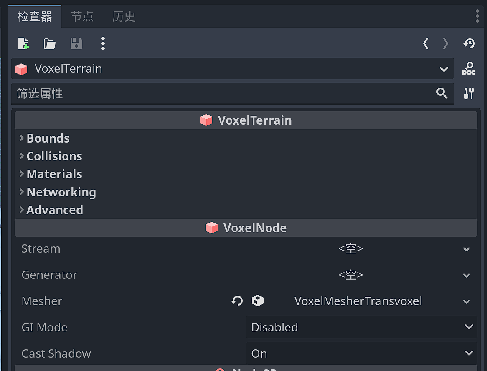

# 地形类型 

Godot voxel提供两种类型的体素地形VoxelTerrain和VoxelLodTerrain，两种地形都有各自的优缺点。但也有很多共同点，但也以非常不同的方式处理块。

## 共同属性

VoxelTerrain和VoxelLodTerrain都继承自 `VoxelNode` ，因此它们拥有部分相同的属性。

-     `stream` ：允许 `VoxelStream` 加载和保存体素的资源。参照：[Voxel Streams](https://voxel-tools.readthedocs.io/en/latest/streams/)。
-     `generator` ：一种 `VoxelGenerator` 资源，允许使用生成的体素填充体积。请参阅[Generators](https://voxel-tools.readthedocs.io/en/latest/generators/)。
-     `mesher` ：定义 `VoxelMesher` 体素外观的资源。它还定义碰撞网格（如果启用）。

###  碰撞

基于物理的碰撞默认处于启用状态，其行为类似于StaticBody。它提供光线投射和碰撞检测。您可以通过在任何地形节点上设置 `generate_collisions` 该选项来打开或关闭它。或者，您可以在代码中启用或禁用它。

碰撞与网格一起构建。因此，任何已构建的块都不会受到此设置的影响，除非它们被重新生成。

您还可以打开碰撞金属丝网进行调试。在编辑器中，在“调试”菜单下查找 `Visible Collision Shapes` 。

## VoxelTerrain

此节点在VoxelViewer周围的立方体网格中创建块。它不处理细节级别，因此它的视距有限。这也意味着它非常适合较小的地形或体素体积。它通常可以在每个方向上处理大约 300 个体素，然后变慢。

## VoxelLodTerrain

此节点在VoxelViewer周围的八叉树中创建块，以便最近的块较小且具有更高的细节级别，而距离较远的块更大且细节级别较低。这允许在使用更少资源的同时拥有更大的可视距离。

Blocky meshers目前不支持它。只有Blocky meshers才能工作。
