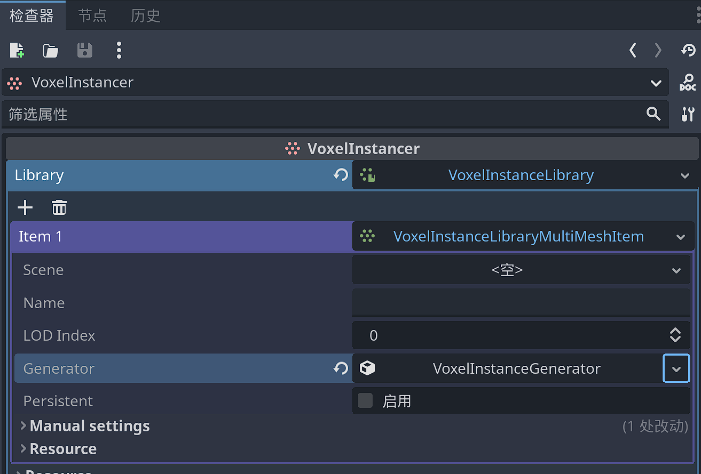
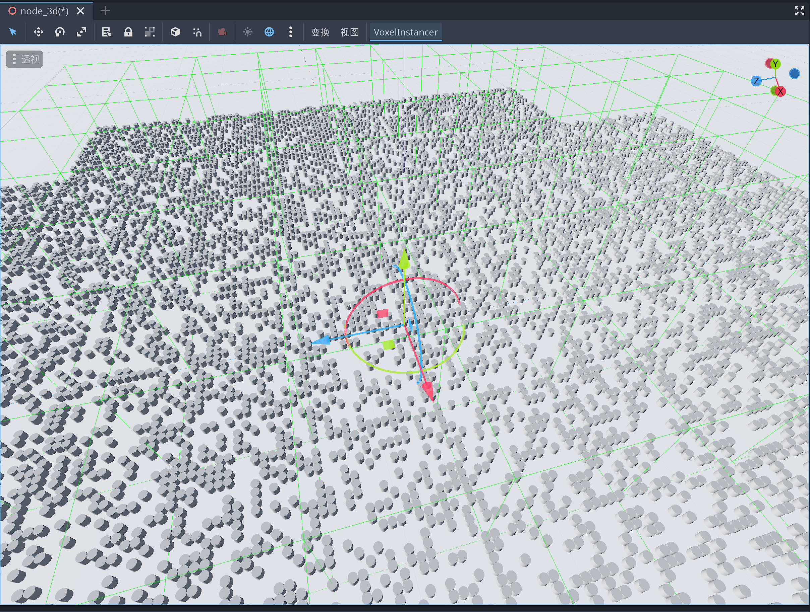
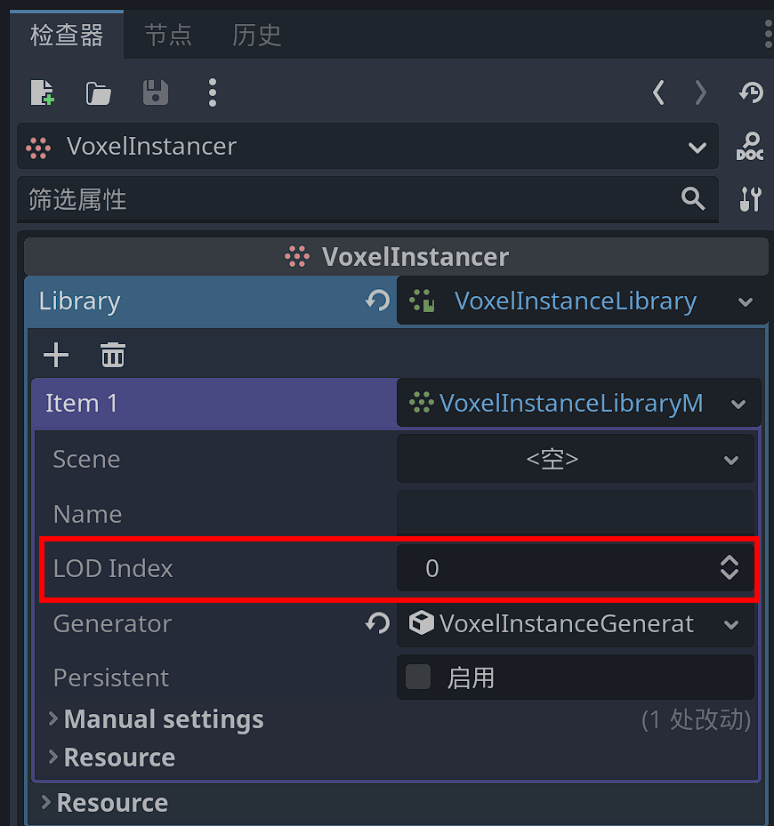

# 基于VoxelInstancer的实例化

## 概述

Godot Voxel提供了一个`VoxelInstancer`节点，以及基于它的实例化系统，用于在地形的表面实例化网格或场景。必须将此节点添加为体素地形的子节点。


它可以生成两种不同类型的对象：

-     
    多网格实例。它们可以非常多，并且可以选择发生碰撞。
-     
    场景实例。他们使用常规场景，但是速度要慢得多，因此应调整为低数字。


该系统主要用于模仿自然分布：随机生成草，岩石，树木、树叶和其他。它不适合复杂的人造结构，如房屋或村庄，但如果可用功能适合您的游戏，在某些情况下可以使用场景实例。

此功能目前仅在 `VoxelLodTerrain` 下可用。

## 基础使用

在`VoxelLodTerrain` 节点下添加一个`VoxelInstancer`子节点。


为其`Library`属性创建一个新的`VoxelInstanceLibrary`资源。并为其添加一个MutiMesh项。




此时默认成绩中已经出现了随机分布的立方体，它们嵌入地形网格的表面。


更改地形的生成器类型，也会自动更新实例化的内容。


---

**注意**

如果你正在制作一颗行星，你可能想将  `VoxelInstancer` 的`up_mode` 设置为 `Sphere` 模式。这将告诉Instancer向上的方向在哪里，并根据地形的本地原点对齐项目。

---

### 修改实例化的网格

通过Mesh属性，可以指定实例化的网格。


比如我们修改默认的立方体为圆柱体，则整个实例化的网格都变为了圆柱体。



###  修改生成的范围

`VoxelInstancer` 实例化网格的范围基于体素地形本身的 LOD 系统。你可以通过修改`VoxelInstanceLibraryItem `的`lod_index` 属性修改范围的大小。



例如，选择 `0` 将使物品在最近的范围内生成，并在远处快速淡出。更高的索引将在更大的范围内生成，因此随着玩家越来越近，也会更早地开始出现。实例在与地面相同的“块”中生成。


通常，场景可能由多个图层组成，因此越接近，细节就越多。一些较大的项目可以使用较高的 `lod_index`，这样就可以看到很远的地方，而较小的项目可以使用较低的 `lod_index`。


在选择合适的网格时需要考虑一个平衡 `lod_index` ：目前，较大的索引更加不精确，因为它们在较低分辨率的网格之上工作。当靠近时，可能会看到这样的实例漂浮在地面上，或者沉入其中。这主要发生在山脊、裂缝或洞穴等变化剧烈的地区：


为了解决这个问题，您可以调整与项目 `generator` 关联的 `offset_along_normal` 参数。这取决于资产，因此将它们设计为可以将部分底部沉入地下可能会产生一些误差。


有时可能还不够，所以这个问题仍然需要在将来解决。可能的方法包括：

-     
    查询世界生成器以在不使用网格的情况下近似表面（如果对地面进行了编辑，则不适合）
-     
    随着更高分辨率数据的可用，逐渐以某种方式捕捉实例
-     一次加载整个世界的编辑体素，以便即使从远处也可以查询它们（占用更多内存）

---

**注意**

制作草或其他物品时，最好使用自定义着色器根据与摄像机的距离淡化网格，这样它们就不会突然消失。使用相似颜色的地面纹理也有助于使其混合。

---

###  网格 LOD


包括一个辅助LOD系统，它在一定程度上适用于网格体本身。Godot 3没有LOD系统（Godot 4有），因此这允许从一组可见网格内减少远距离的顶点数量。


要使用它，您必须在 `VoxelInstanceLibraryItem` 以下位置填充 3 个网格 LOD 属性：


如果仅设置该 `mesh` 属性，则不会使用 LOD。


选择 LOD 的距离当前是硬编码的，因为它取决于该项目的加载块，而后者又取决于 `lod_index` `lod_distance` 父体素地形的属性。


如果需要较少的LOD，则可以分配两次相同的网格。这个系统非常严格，因为在Godot 4中，它可能会被更改为只有一个专用于冒名顶替者网格的插槽。事实上，Godot 4 可能支持网格体上的 LOD，但并没有计划让最后一个 LOD 成为冒名顶替者，所以这应该仍然可以实现。

 注意


冒名顶替者网格是简单的四边形，可以在很远的距离上伪造真实模型的存在。例如，这是一种从远处渲染森林的非常快速的方法，同时能够在靠近时使用详细的树木。

###  版本


尚不支持在编辑器中手动编辑实例。只能使用过程生成来定义实例生成的位置。


但是，在挖掘它们生成的地面时，可以从游戏中移除它们。

###  持久性


某些项目可能是永久性的。可以使用 VoxelInstanceLibraryItem 的属性启用 `persistent` 此选项。如果父地形有 `VoxelStream` 支撑，则来自已编辑方块的实例将保存到流中，并且下次玩家靠近该区域时不会重生。非持久性实例将始终在满足过程条件的每个图面上重生。


持久性项的 ID 很重要，因为它将在保存的数据中使用。如果删除项目并尝试从仍包含实例的流中加载实例，则会出现警告。


在撰写本文时，只有VoxelStreamSQLite支持保存实例。


本文档介绍了保存格式。

## 从场景创建MutiMesh项


可以添加现有场景为MutiMesh项。场景将被转换以适合多网格的实例化渲染。场景方式可以设置碰撞体。


有两种方法可以从场景进行设置：

-     
    分配 `scene` 属性。这将在运行时转换场景。场景将链接到项目，因此如果场景发生变化，它将保持更新。
-     
    使用检查器顶部的 `Setup from scene` 按钮。这不会链接场景，而是分配在编辑器中执行转换的手动属性。如果场景发生变化，该项目将不会更新。如果场景嵌入了网格、材质或纹理，它们最终可能会被复制到项目的资源文件中。


转换过程希望场景遵循特定结构：

```
- PhysicsBody (StaticBody, RigidBody...)
    - MeshInstance_LOD0 <-- "LOD" suffixes are optional but allow to specify the 4 LODs if needed
    - MeshInstance_LOD1
    - MeshInstance_LOD2
    - MeshInstance_LOD3
    - CollisionShape1
    - CollisionShape2
    - ...
```


可以通过两种方式设置材质：

-     
    `material_override` 在网格实例上
-     
    直接在网格资源上添加材料


不支持 `MeshInstance` 节点上的曲面材料属性。

###  场景实例


多网格项目快速高效，但有局限性。


通过添加类型 `VoxelInstanceLibrarySceneItem` 为的项目来支持实例化场景。常规场景实例将创建为 的 `VoxelInstancer` 子级，而不是生成多网格体。优点是能够对它们施加更多样化的行为，例如脚本、声音、动画，甚至进一步生成逻辑或交互。唯一的约束是，场景的根必须是 `Node3D` 或派生自它。

与多网格实例相比，这种自由度的代价很高。添加许多实例可能会很快变慢，因此从编辑器创建这些项目时，这些项目的默认密度较低。强烈建议不要使用太复杂的场景，因为根据设置，如果您的计算机无法处理太多实例，可能会导致Godot冻结或崩溃。

---

**警告**

如果将场景添加到库中，然后尝试从同一场景加载该库，Godot 将崩溃。这是一个循环引用，目前很难在所有情况下检测到。

---

##  程序生成

###  内置生成器


项目是使用默认的内置生成器添加的，因此它们已经根据程序规则生成，而不是手动绘制。您可以通过检查 `generator` VoxelInstanceLibraryItem 的属性来调整生成器。


位于游戏中编辑的块中的持久实例将不再重新生成。

## 自定义实例生成器


该功能是最新的，API 可能仍会更改，因此目前脚本无法使用此功能。

## 流事件（高级）


`VoxelInstancer` 知道何时通过向父级的块事件注册来生成事物。这目前不适用于 的 `VoxelLodTerrain` 脚本 API，但将来可能会添加。
