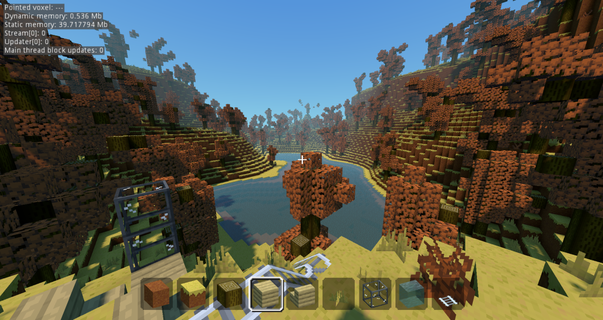

# 学习资源

### Godot Voxel原项目

- GitHub仓库：https://github.com/Zylann/godot_voxel

### 视频教程

- [【Godot教程】用 Godot制作《我的世界》风格的游戏！_哔哩哔哩_bilibili](https://www.bilibili.com/video/BV1mN411J7yv/?spm_id_from=333.337.search-card.all.click)
- 使用平滑透体素方法的戈多体素工具模块的体素地形教程（由 Aknakos 提供）（2021 年 6 月 17 日）
- 如何在戈多制作体素地形（Tokisan Games）（2019年11月4日）
- 戈多体素工具（由游戏从零开始）（2020年7月25日）

###  演示项目

本地下载安装Godot Voxel后，就可以下载以下三个演示项目进行辅助学习，三个项目都是由Godot Voxel的主要作者[Zylann](https://github.com/Zylann)创建的。所以也算是第一手的学习资料了。

| 截图                                                         | 概述                                                         | 链接                                                         |
| ------------------------------------------------------------ | ------------------------------------------------------------ | ------------------------------------------------------------ |
|  | 基于Godot Voxel程序生成的体素地形和其他模型网格，基本上实现了《我的世界》的很多功能。 | [体素游戏演示（戈多引擎 4.0）](https://github.com/Zylann/voxelgame#voxel-game-demos-godot-engine-40) |
|             | 基于Godot Voxel程序生成星球。Youtube[演示视频](https://www.youtube.com/watch?v=8OrZX347MoE)，整体感觉有点像《无人深空》低配版。 | 3D太空游戏演示                                               |
|  | 包含基于Godot Voxel的多个演示。                              | [Godot体素工具的演示集合](https://github.com/tinmanjuggernaut/voxelgame) |