# 平滑地形


可以使用有符号距离场和 `VoxelMesherTransvoxel` .

##  有符号距离场

###  概念


为了表示平滑地形，使用点为 0 或 1 的格网是不够的。这样的网格适用于多边形块状表面，但不适用于曲线。它可以以某种方式平均或模糊，但这将是昂贵的。


对于空间中的任何点，有符号距离场 （SDF） 是到最近表面的距离。它是“有符号的”，因为如果点在表面下方（“某物内部”），则该距离变为负数。这意味着曲面由 SDF 为 0 的所有点定义。这 `0` 通常称为 `isolevel` .


SDF 通常用于光线行进着色器中，作为定义体积的一种方式。它也用于Transvoxel算法（行进立方体的变体），该算法由该引擎实现。因此，体素存储的不是离散值，而是存储一种平滑的距离“梯度”。

###  技术说明


体素在 3D 中使用 SDF，因此为了帮助可视化它，我们将查看 2D 示例。如果我们要表示一个具有块状体素的球体，我们会将以下伪代码应用于每个体素：

```swift
if distance(center, position) < radius:
    voxel = 1
else:
    voxel = 0
```


这给出了以下内容：

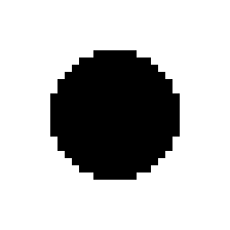


每个体素都有连个值，即 1 或 0。但这并没有提供关于“物质”和“空气”之间如何发生转换的信息，所以如果我们使用 Transvoxel 渲染它，结果将是：

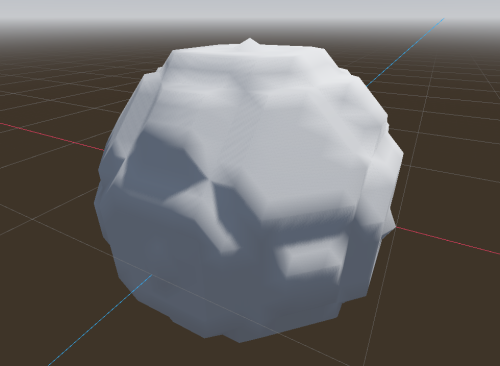


它有点块状。现在，我们可能确实想要这个结果（请参阅有关着色器的部分）。但是如果我们不这样做，我们将需要更改代码。事实上，如果我们往后退一步，答案就已经存在了：

```swift
voxel = distance(origin, position) - radius
```


这是球体的有符号距离。此处显示归一化，因此接近 `0` 的体素为灰色：

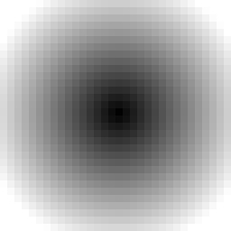


现在，每个体素都包含一个缓慢变化的渐变，因此当Transvoxel遍历所有单元格以找到表面时，它将看到比“或 `1` ” `0` 更精确的变化，这允许它产生平滑的多边形。

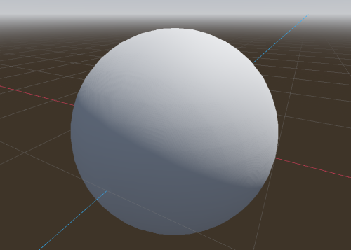

###  缩放和夹紧


该引擎允许编辑体素并保存它们。存储真正的 SDF 对于游戏来说可能很昂贵。例如，因为这是一个距离，如果玩家在地面上建造一座小塔，我们将不得不让体素在天空中保持最新状态，只是因为塔使地面稍微靠近它们。因此，在实践中，不需要处理确切的SDF。我们只需要足够好的东西，所以梯度可以以不同的速度变化，修改可以保持“局部”。


远在天空中的体素对我们来说实际上并不有趣。表面是我们真正需要的。因此，我们可以夹紧距离，这样离表面足够远的体素将具有相同的值。如果整个块具有相同的值，则可以将其优化为“均匀”。


因此，我们之前看到的球体 SDF 在数据中实际上看起来像这样：

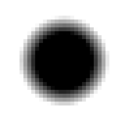


在多个块上，所有没有梯度的区域将占用很少的内存空间。


为了节省更多内存，此引擎不使用 32 位 `float` 数字存储 SDF（默认情况下不是）。相反，它使用 8 位或 16 位整数，这些整数被解释为 -1 到 1 之间的定点十进制数。任何更低或更高的东西都被夹紧。这意味着我们必须调整要存储的距离以最好地利用此间隔。


实际上，这意味着在将 SDF 存储在 `VoxelBuffer` 中之前，我们在使用 16 位时将其缩放 `0.1` 或更低。比例越低，梯度在被钳制之前的时间越长，但用于存储该变化的内存就越多。它也不应该太低，因为 16 位不能表示太小的变体。如果使用大量 LOD 级别，则可能需要调整此比例，因为如果从很远的地方看到体素，则渐变需要延长足够长的时间才能保持平滑。


有关 SDF 和使用它们的其他域的详细信息，您可以查看以下一些视频：

-  [字形、形状、字体、有符号的距离字段。（马丁·唐纳德）](https://www.youtube.com/watch?v=1b5hIMqz_wM)
-  [编程冒险：行进的立方体（塞巴斯蒂安·拉格）](https://www.youtube.com/watch?v=M3iI2l0ltbE)
-  [用数学画一个卡通女孩（Inigo Quilez）](https://www.youtube.com/watch?v=8--5LwHRhjk)
-  [一堆SDF函数和操作的代码（Inigo Quilez）](https://iquilezles.org/articles/distfunctions/)

## Transvoxel

###  定义


Transvoxel 是行进立方体的扩展，可用于从体素数据创建平滑网格。该算法的优点是可以集成不同层次细节的拼接而不会引起裂缝，因此可用于渲染非常大的景观。


有关更多信息，请访问 https://transvoxel.org/。

### 顶点着色器中的平滑拼接


Transvoxel使用特殊的网格来拼接不同细节级别的块。然而，接缝可能仍然可见，偶尔会有尖锐的小台阶。为了平滑这一点，生成的 `VoxelMesherTransvoxel` 网格在其 `CUSTOM0` 属性中包含额外的信息，告诉如何移动顶点以平滑这些步骤，并在网格的常规部分中为它们腾出空间。


在您的地形上创建和设置 ， `ShaderMaterial` 并将以下代码片段集成到其中：

```c++
// 这是由体素引擎自动识别和指定的
uniform int u_transition_mask;

float get_transvoxel_secondary_factor(int idata) {
    int cell_border_mask = idata & 63; // 单元格接触哪一侧
    int vertex_border_mask = (idata >> 8) & 63; // 顶点接触哪些边
    // 如果顶点靠近有低分辨率邻居的一侧，则将其移动到次要位置
    int m = u_transition_mask & cell_border_mask;
    float t = float(m != 0);
    // 如果顶点位于一条或多条边上，并且至少有一条边没有低分辨率邻居，则不要移动顶点。
    t *= float((vertex_border_mask & ~u_transition_mask) == 0);
    return t;
}

vec3 get_transvoxel_position(vec3 vertex_pos, vec4 fdata) {
    int idata = floatBitsToInt(fdata.a);

    // 移动顶点以平滑过渡
    float secondary_factor = get_transvoxel_secondary_factor(idata);
    vec3 secondary_position = fdata.xyz;
    vec3 pos = mix(vertex_pos, secondary_position, secondary_factor);

    // 如果网格组合了过渡，并且顶点属于过渡，则当该过渡未处于活动状态时，我们会更改顶点的位置，以便所有三角形都将退化且不可见。这是单独渲染它们的一种替代方案，这样可以减少绘制调用，也可以减少在Godot中创建的网格资源。理想情况下，我会像LOD一样调整索引缓冲区，但Godot不会公开任何使用它的东西
    int itransition = (idata >> 16) & 0xff; // 顶点在过渡网格上吗？
    float transition_cull = float(itransition == 0 || (itransition & u_transition_mask) != 0);
    pos *= transition_cull;

    return pos;
}

void vertex() {
    VERTEX = get_transvoxel_position(VERTEX, CUSTOM0);
    //...
}
```


导致此代码的研究问题：问题#2

##  纹理


对体素表面进行纹理处理可能比经典 3D 网格更困难，因为几何图形事先并不知道，并且几乎可以具有任何形状。因此，在本节中，我们将回顾解决UV映射，程序技术和从体素数据混合纹理的方法。

###  三平面映射


经典的 UV 映射不能用于平滑的体素表面，因为它可以包含任意形状。事实上，平滑网格划分器不提供任何适当的 UV。因此，我们可以改用三平面映射。


该方法涉及将纹理投影到直接面向 X 轴的对象部分。然后将其投影到直接面向 Y 轴的侧面。然后再次用于 Z 轴。然后将这些投影的边缘以指定的锐度混合在一起。


看看砖块纹理是如何在右上角的球体上混合在一起的。

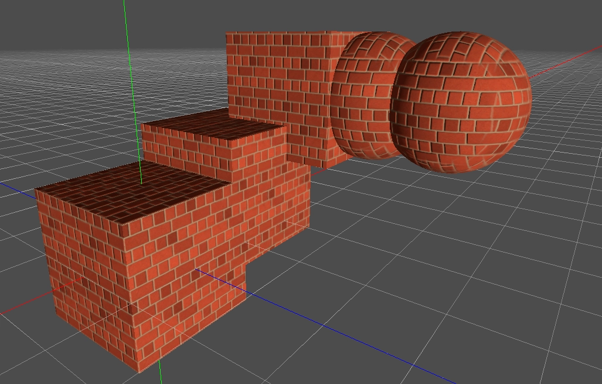


阅读有关戈多中的三平面映射的信息。


也可以为 3 个轴选择不同的纹理。


这是一个着色器，它支持两种材质，例如顶部的草和侧面的岩石，每种材质都有三平面映射的反照率、法线和 AO 贴图，然后根据它们的法线朝向上还是面向侧面混合在一起。


您可以在演示中找到工作示例，或查看着色器本身（此处定义的三平面函数 https://github.com/Zylann/voxelgame/blob/godot4/project/smooth\_terrain/shaders/triplanar.gdshaderinc）。


在着色器参数中，添加两个反照率贴图、法线贴图和 AO 贴图（可选）。然后使用 和 滑块来调整顶部 `AB Mix 1` 和 `AB Mix 2` 侧面混合在一起的方式。其他设置应不言自明。下面的屏幕截图还添加了一点雾和远自由度。


###  程序纹理


体素数据量很大，因此，如果游戏的纹理规则足够简单，可以从着色器确定并且不影响游戏玩法，则无需在体素中定义任何额外的数据。例如，您可以检查地形表面的法线以混合草和岩石纹理，并使用一定高度以上的雪。

### 4-混合超过16种纹理

####  体素数据


如果希望纹理来自体素数据， 具有 `VoxelMesherTransvoxel` 一个 `texture_mode` 可以设置为 `TEXTURES_BLEND_4_OVER_16` .此模式最多允许 16 个纹理，并且每个体素仅混合 4 个最常用的纹理。它期望 `INDICES` 和 `WEIGHTS` 通道中的体素数据编码为 16 位深度值。每个体素有 4 个权重和 4 个索引，每个使用 4 位。它非常紧密，不允许长梯度，但在大多数情况下应该足够了。

```
          1st byte    2nd byte
INDICES:  aaaa bbbb   cccc dddd
WEIGHTS:  aaaa bbbb   cccc dddd
```


默认情况下，这些通道默认为索引 `(0,1,2,3)` 和权重 `(1,0,0,0)` ，这意味着体素始终以纹理开头 `0` 。


该功能是最新的，需要在此领域进行进一步的工作或更改。目前，指数和权重大多是手动应用的。可以直接设置它们， `VoxelTool.set_voxel` 但由您正确包装它们。一种简单的绘画方法是使用 `VoxelTool.do_sphere()` ：

```swift
# 在球体区域中绘制纹理2（不创建物质）
voxel_tool.set_mode(VoxelTool.MODE_TEXTURE_PAINT)
voxel_tool.set_texture_index(2)
voxel_tool.set_texture_opacity(1.0)
voxel_tool.do_sphere(hit_position, radius)
```


也可以使用特殊输出生成 `VoxelGeneratorGraph` 它，但它仍然需要一些数学运算才能生成有效数据。

####  网格数据


网格器将在顶点 `CUSTOM1` 的属性中包含纹理信息。与体素值相反，打包的信息将具有 8 位精度：

-     
    `CUSTOM1.x` 将包含 4 个索引，编码为 4 个字节，可以通过将浮点数重新解释为整数并使用位移运算符来获得。
-     
    `CUSTOM1.y` 将包含 4 个权重，再次编码为 4 个字节。


每个索引指示需要使用哪种纹理，每个权重分别指示应混合多少纹理。它本质上与经典的彩色贴图相同，只是纹理可以变化。一个小缺点是每个体素不能混合超过 4 个纹理，因此如果发生这种情况，可能会导致伪影。但在实践中，人们认为这种情况很少见，可以忽略不计。

####  着色器


以下是您需要的着色器代码：

```swift
shader_type spatial;

// 纹理最好在TextureArray中，所以查找它们很便宜
uniform sampler2DArray u_texture_array : source_color;

// 我们需要将数据从顶点着色器传递到片段着色器
varying vec4 v_indices;
varying vec4 v_weights;
varying vec3 v_normal;
varying vec3 v_pos;

// 我们将使用一个实用程序函数来解码组件。
// 它返回[0.255]范围内的4个值。
vec4 decode_8bit_vec4(float v) {
    uint i = floatBitsToUint(v);
    return vec4(
        float(i & uint(0xff)),
        float((i >> uint(8)) & uint(0xff)),
        float((i >> uint(16)) & uint(0xff)),
        float((i >> uint(24)) & uint(0xff)));
}

// 体素网格可以在任何方向上具有悬垂，因此我们可能必须使用三平面映射函数
vec3 get_triplanar_blend(vec3 world_normal) {
    vec3 blending = abs(world_normal);
    blending = normalize(max(blending, vec3(0.00001))); // Force weights to sum to 1.0
    float b = blending.x + blending.y + blending.z;
    return blending / vec3(b, b, b);
}

vec4 texture_array_triplanar(sampler2DArray tex, vec3 world_pos, vec3 blend, float i) {
    vec4 xaxis = texture(tex, vec3(world_pos.yz, i));
    vec4 yaxis = texture(tex, vec3(world_pos.xz, i));
    vec4 zaxis = texture(tex, vec3(world_pos.xy, i));
    // 混合3个平面投影的结果。
    return xaxis * blend.x + yaxis * blend.y + zaxis * blend.z;
}

void vertex() {
    // 索引是整数值，因此我们可以按原样对其进行解码
    v_indices = decode_8bit_vec4(CUSTOM1.x);

    // 权重必须在[0..1]中，所以我们将它们分开
    v_weights = decode_8bit_vec4(CUSTOM1.y) / 255.0;

    v_pos = VERTEX;
    v_normal = NORMAL;

    //...
}

void fragment() {
    // 为方便起见，定义纹理比例。
    // 如果每个索引需要不同的刻度，我们可以使用数组。
    float uv_scale = 0.5;

    // 对4个混合纹理进行采样，所有纹理都具有三平面贴图。
    // 我们可以对所有函数重复使用相同的三平面混合因子，因此将函数的这一部分分离会稍微提高性能。
    vec3 blending = get_triplanar_blend(v_normal);
    vec3 col0 = texture_array_triplanar(u_texture_array, v_pos * uv_scale, blending, v_indices.x).rgb;
    vec3 col1 = texture_array_triplanar(u_texture_array, v_pos * uv_scale, blending, v_indices.y).rgb;
    vec3 col2 = texture_array_triplanar(u_texture_array, v_pos * uv_scale, blending, v_indices.z).rgb;
    vec3 col3 = texture_array_triplanar(u_texture_array, v_pos * uv_scale, blending, v_indices.w).rgb;

    // 获取权重并确保它们被规范化。
    // 我们可能会增加一个很小的安全裕度，这样我们就可以承受一定程度的错误。
    weights /= (weights.x + weights.y + weights.z + weights.w + 0.00001);

    // 计算漫反射
    vec3 col = 
        col0 * weights.r + 
        col1 * weights.g + 
        col2 * weights.b + 
        col3 * weights.a;

    ALBEDO = col;

    //...
}
```

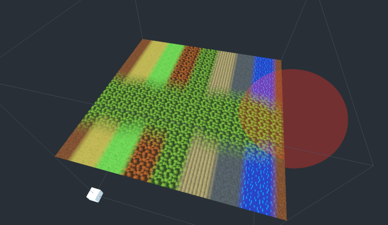

 注意


如果您只需要 4 个纹理，则可以将索引保留为其默认值（包含 `0,1,2,3` ）并仅使用权重。使用 时，只能使用 `VoxelTool` 纹理索引 0、1、2 或 3。在这种情况下，纹理数组不太相关。

###  推荐阅读

-     
    空间材质 - 演示了Godot中可用的许多着色器选项。
-     
    着色索引 - 教程和着色器语言 API
-     
    着色器 API 参考 - 一些最常访问的参考
    -    [着色语言](https://docs.godotengine.org/en/stable/tutorials/shading/shading_reference/shading_language.html)
    -    [空间着色器](https://docs.godotengine.org/en/stable/tutorials/shading/shading_reference/spatial_shader.html)

##  着色


默认情况下，平滑体素还通过共享顶点生成平滑网格。这也会导致网格在内存中更小。

### 低多边形/平面阴影外观


目前无法使网格器生成具有分割平面三角形的顶点，但您可以在片段着色器中使用它。

 使用 Vulkan 时：

```swift
NORMAL = normalize(cross(dFdy(VERTEX), dFdx(VERTEX)));
```

 使用 OpenGL 时：

```swift
NORMAL = normalize(cross(dFdx(VERTEX), dFdy(VERTEX)));
```

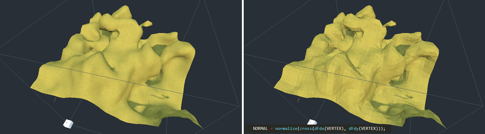

###  块状外观


也可以为“平滑”体素提供“块状”外观：

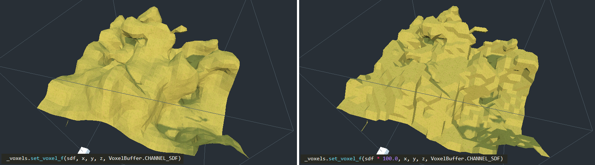


这可以通过在体素生成器中饱和 SDF 值来完成：它们必须始终为 -1 或 1，没有转换值。由于值 `set_voxel_f` 在使用时是固定的，因此乘以大量也有效。内置的基本生成器可能没有此选项，但如果使用自己的生成器脚本或 `VoxelGeneratorGraph` .


您还可以在着色器中使着色硬边以获得更好的效果。

##  着色器 API 参考


如果在体素节点上使用 ， `ShaderMaterial` 模块可能会利用一些统一的（着色器参数）名称来提供额外信息。有些是功能工作所必需的。

|  参数名称 |  类型 |  描述 |
| --- | --- | --- |
| `u_lod_fade` | `vec2` |  有关细节级别之间渐进淡入淡出的信息。仅与 一起使用 `VoxelLodTerrain` 。见 Lod 褪色 |
| `u_block_local_transform` | `mat4` |  渲染块的变换，本地到整个体积，因为它们可能使用多个网格渲染。如果体积在移动，则可用于修复三平面映射。目前仅可用 `VoxelLodTerrain` 。 |
| `u_voxel_cell_lookup` | `usampler2D` |  3D `RG8` 纹理，其中每个像素包含一个以字节 `R` 和 `G` 部分 （ ） 为单位的单元格索引，以及一个以 （ ） `r + ((g & 0x3f) << 8)` 的 2 位为单位的 `G` 轴索引 `g >> 6` 。用于索引此纹理的位置相对于网格的原点。纹理是 2D 和正方形的，因此可以计算坐标，知道体素中网格的大小。将仅使用法线贴图的详细纹理在网格中分配。 |
| `u_voxel_normalmap_atlas` | `sampler2D` |  纹理图集，其中每个图块都包含一个模型空间法线贴图（与普通法线贴图不同，它不相对于表面）。坐标可以从 和 `u_voxel_virtual_texture_tile_size` 计算 `u_voxel_cell_lookup` 。UV 方向类似于三平面映射，但轴是从中 `u_voxel_cell_lookup` 的信息中知道的。将仅使用法线贴图的详细纹理在网格中分配。 |
| `u_voxel_virtual_texture_tile_size` | `int` |  中 `u_voxel_normalmap_atlas` 每个磁贴的分辨率（以像素为单位）。 |
| `u_voxel_cell_size` | `float` |  网格中一个立方体单元的大小，以模型空间单位表示。在具有法线贴图的体素网格中将> 0。 |
| `u_voxel_block_size` | `int` |  网格表示的体素立方块的大小（以体素为单位）。 |
| `u_voxel_virtual_texture_fade` | `float` |  启用 LOD 淡入淡出后，此值将介于 0 和 1 之间，表示在细节纹理（如 `u_voxel_normalmap_atlas` .它们需要时间来更新，因此可以使它们顺利显示。如果未启用淡入淡出，则值为 1;如果网格没有细节纹理，则值为 0。 |
| `u_voxel_virtual_texture_offset_scale` | `vec4` |  在启用了法线贴图的 LOD 地形中使用。包含采样 `u_voxel_cell_lookup` 时要应用的转换和 `u_voxel_normalmap_atlas` 。 `x` ， `y` 并 `z` 包含偏移量和 `w` 比例。当当前网格体的纹理尚未准备就绪时，这一点很重要，因此它会回退到父 LOD：父网格更大，因此我们需要对子区域进行采样。 |
| `u_transition_mask` | `int` |  使用 `VoxelMesherTransvoxel` 时，这是一个位掩码，用于存储有关不同细节级别的相邻网格的信息。如果网格的 6 个边之一具有分辨率较低的相邻边，则相应的位将为 `1` 。侧索引按顺序 `-X` 排列 、 。 `X` `Z` `-Y` `Y` `-Z` 查看顶点着色器中的平滑拼接。 |

## 详细级别 （LOD）


`VoxelLodTerrain` 实现平滑地形的动态细节级别。

###  描述


LOD（细节层次）是一种用于动态更改几何体数量的技术，使得靠近查看器的网格具有高清晰度，而远离查看器的网格则简化。这旨在提高性能。

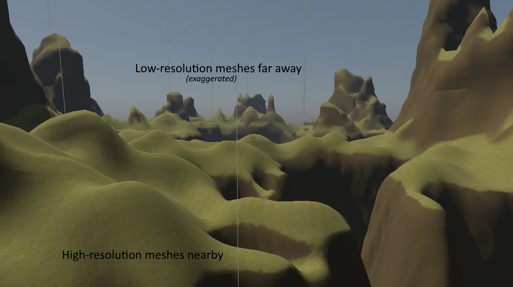

 注意


注意：在这个引擎中， `LOD` 关卡经常用从 to `N-1` 的数字 `0` 表示，其中 `N` LOD 的数量。 `0` 是最高级别的细节，而LOD `1` 等 `2` `N-1` 是较低级别的细节。

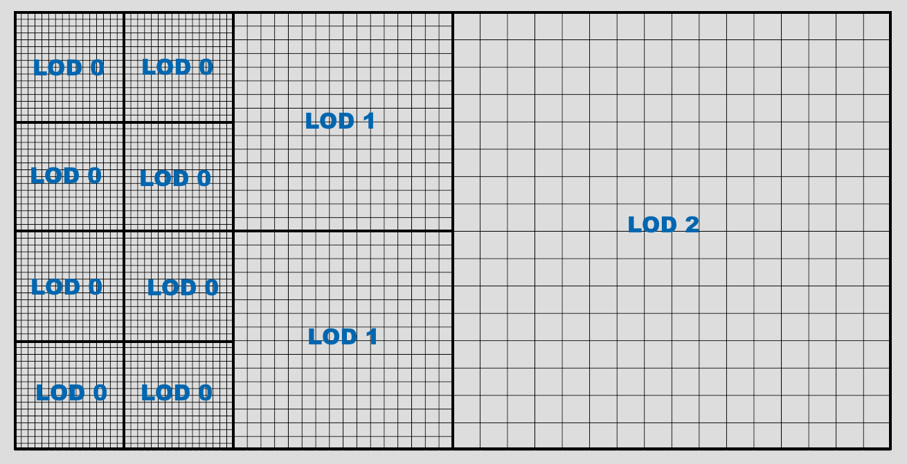


当从LOD `i` 到 `i+1` ，体素和块的大小加倍，覆盖更多的空间。但是，块的分辨率不会改变，因此细节密度较低，消耗的资源更少。

###  八叉树


LOD 是使用八叉树网格实现的。然后可以将每个八叉树细分为可变大小的块，其中最小大小将为 LOD 0。


随着观看者越来越近，细分就会发生。它发生的阈值由 `lod_distance` 属性控制。它表示 LOD 0 将在查看器中传播多远。它还会影响其他LOD的移动距离，因此它可以控制整体质量。


与 `VoxelTerrain` 类似 ，当观看者四处移动时，章鱼树被加载在前面，而那些走得太远的章鱼树被卸载。这允许保持对“无限”地形的支持，而无需设置具有不必要的深度级别的单个八叉树。


在编辑器中，小控件显示八叉树的网格。可以通过选中 `Terrain -> Show octree nodes` 菜单来显示块边界。


查看器周围的网格大小取决于两个因素：

-     
    的 `view_distance` `VoxelLodTerrain` 参数
-     
    上的 `view_distance` `VoxelViewer` 参数。

###  LOD 数量


增加LOD的数量允许地形具有更大的八叉树，这反过来又允许增加视图距离。它实际上并没有变得更 `LOD0` 清晰，而是相反（如果你另有预期，也许你需要调整你的生成器以产生更大的形状，减小体素大小或改变游戏的规模，这可能太小）。您可能会注意到，如果您更改 LOD 计数，八叉树的网格会改变大小：这是因为它四舍五入到当前 `view_distance` .


减少LOD的数量可以减小八叉树的大小，但这也意味着将有更多的八叉树填充网格 `view_distance` 。确保在LOD计数和八叉树的密度之间保持良好的最佳平衡点， `view_distance` 以便八叉树的密度不会太高。


如果您没有创建无限地形，则可以为其提供属性的 `bounds` 固定边界，以及非常大的视图距离，以便它保持在视野中。 `bounds` 将四舍五入为八叉树大小：例如，如果 4 个 LOD 和网格块大小为 16，LOD0 块将为 16，LOD1 将为 32，LOD2 将为 64...LOD3（最大）将为 128。由于当前实现在原点周围至少保留了 8 个八叉树，因此此设置的最佳边界为 256。

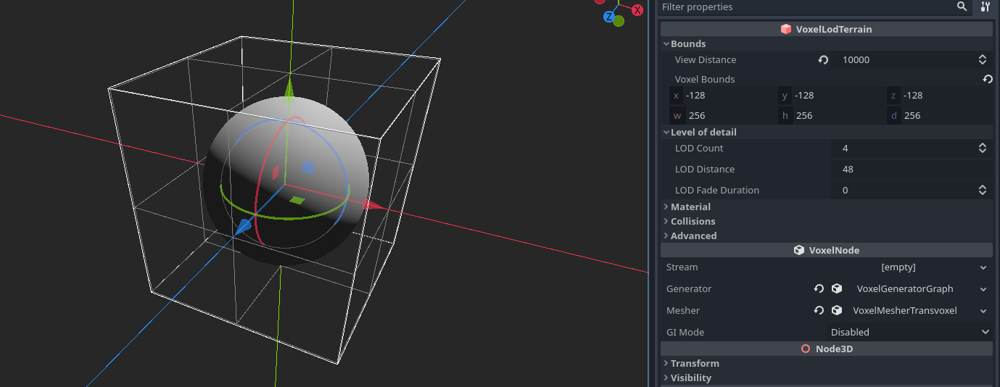


遵循相同的逻辑，512 的固定边界对于 5 个 LOD 是最佳的，1024 对于 6 个 LOD 是最佳的，依此类推。这是基于 的 `16` 网格块大小，因此如果将其设置为 `32` ，则可以少设置一个 LOD，因为网格的大小是其两倍。


有关编辑器中 LOD 行为的信息，请参阅编辑器中的摄像机选项。

###  体素大小


目前，体素的大小固定为 1 个空间单位。在将来的版本中可能会更改它。目前，解决方法是缩减节点。但是，请确保它是均匀的刻度，并注意不要刻度太低，否则可能会爆炸。


`scale` 从 Node3D 不能与大小的概念混淆。如果更改 `scale` ，它还将缩放体素网格、查看距离、可能在生成器中设置的所有维度，当然它也适用于子节点。结果看起来是一样的，只是更大，没有更多细节。因此，如果您想要更大的内容和更多细节，建议更改这些大小而不是缩放所有内容。例如，如果发生器包含球体和柏林噪声，则可以更改球体的半径和噪声的频率/周期，而不是缩放节点。这样做可以保留体素的大小，从而保持准确性。


Godot还允许您不均匀地缩放，但不建议这样做（也可能导致碰撞问题）。

###  满载模式


LOD 适用于网格和体素数据，使内存使用量保持相对恒定。根据您的设置，远距离体素将不会加载全分辨率数据。只能编辑全分辨率体素，这意味着您只能在查看器周围有限距离内修改地形。


如果此限制不适合您的游戏，解决方法是启用 `full_load_mode` 。这将加载（如果有的话 `stream` ）中存在的所有已编辑的块，以便所有数据都可用，并且可以在任何地方进行编辑而无需等待。未编辑的区块将导致生成器被动态查询而不是缓存。由于不会发生数据流，因此请记住，地形包含的编辑区块越多，将使用的内存就越多。

###  LOD 淡入淡出


LOD 更改可能会在景观中引入一些轻微的“爆裂”，这可能会有点令人不安。缓解此问题的一种方法是在网格从两个不同的细节级别切换时淡入淡出网格。当“父”网格细分为更高分辨率的“子”网格时，它们可以在短时间内同时渲染，而父网格淡出，子网格淡入，反之亦然。此技巧要求您使用 `ShaderMaterial` on `VoxelLodTerrain` ，因为渲染部分需要在片段着色器中增加一些代码。


`VoxelLodTerrain` 有一个属性 `lod_fade_duration` ，以秒表示。默认情况下为 `0` ，这使它处于非活动状态。将其设置为较小的值，例如 `0.25` 将启用它。


在着色器中，添加以下统一：

```swift
// 这是由体素节点自动识别和指定的
uniform vec2 u_lod_fade;
```


还要添加此函数（除非您已经拥有它）：

```swift
float get_hash(vec2 c) {
    return fract(sin(dot(c.xy, vec2(12.9898,78.233))) * 43758.5453);
}
```


在 的 `fragment()` 末尾添加以下内容：

```swift
// 逐步丢弃像素。
// 它必须是最后一个解决方法 https://github.com/godotengine/godot/issues/34966
float h = get_hash(SCREEN_UV);
if (u_lod_fade.y > 0.5) {
    // 淡入
    if (u_lod_fade.x < h) {
        discard;
    }
} else {
    // 淡出
    if (u_lod_fade.x > h) {
        discard;
    }
}
```


注意：这是一个实现示例。可能有更优化的方法可以做到这一点。


这将丢弃，使两个网格的像素互补而不重叠。 `discard` ，以便网格可以保持在同一通道（通常是不透明通道）中渲染。


此技术有一些局限性：

-     
    阴影贴图仍会在褪色网格彼此足够远的情况下创建自阴影。虽然两个网格都渲染为交叉淡入淡出，但其中一个网格最终会在另一个网格上投影阴影。这会产生很多嘈杂的补丁。关闭其中一个阴影并不能修复另一个阴影，关闭阴影会使它们弹出。我还没有找到解决方案。见 https://github.com/godotengine/godot-proposals/issues/692#issuecomment-782331429

###  细节渲染


LOD可以非常快速地消除远处的几何细节。它可以调整，但生成和渲染大量多边形很快就会变得非常昂贵。另一种方法是为中/远网格生成法线贴图，以在其他平面多边形上产生细节错觉。


该引擎包含适用于体素网格的这种技术的实现（感谢 Victor Careil 的洞察力！），因此它甚至可以处理悬垂。


下面是一个没有该功能的景观：

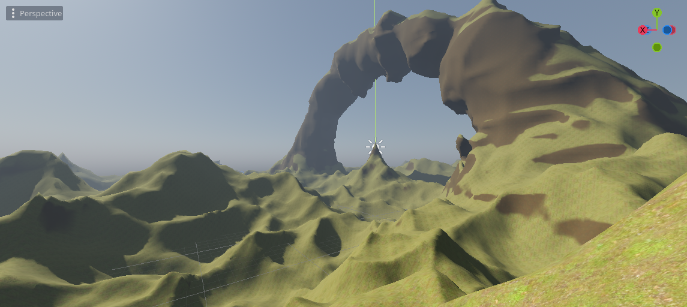

 具有以下功能：

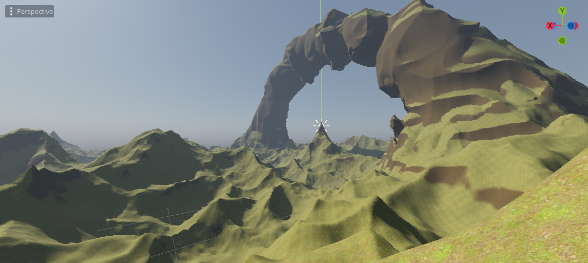


多边形的数量相同：

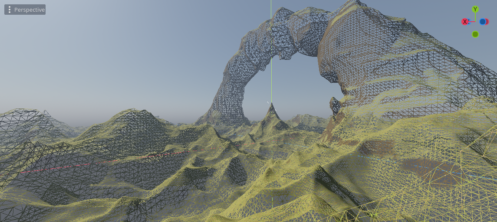


使用 时 `VoxelLodTerrain` ，可以在检查器中打开此功能。成本是网格生成速度较慢，存储法线贴图纹理的内存使用量增加。


此功能仅在 中 `VoxelLodTerrain` 可用。它在关闭数据流的情况下也最有效 （ `full_load_mode_enabled` ），因为能够从远处查看所有细节需要不卸载编辑的块。如果数据流处于打开状态，它仍将使用生成器，但你不会看到编辑的区域。


尽管以比几何体更低的成本改善细节，但细节渲染比生成常规块要昂贵得多。优化它的几种方法是：

-     
    调整磁贴大小和 LOD 级别。瓷砖越大，质量越高，但价格越高。此外，如果在 LOD 0 和 1 处使用，该功能通常不会执行太多操作，因此通常一个好的默认值是从 LOD 2 开始，最小切片大小为 4，最大为 16。
-     
    使用 的 `VoxelGenerator` 简化版本 .可以使用 覆盖 `VoxelLodTerrain.set_normalmap_generator_override` 将用于计算法线贴图的生成器。一个典型的用例是发电机可以产生洞穴。洞穴对表面视觉效果的影响不够，因此在超出某个LOD级别时可以忽略它们。
-     
    使用单边噪声。噪音往往是最大的瓶颈。一般来说，诸如 SIMD 噪声的性能 `FastNoise2` 会更好。

####  着色器


渲染这些法线需要在地形材质中使用特殊的着色器代码。

```swift
// 注意：这不是一个完整的着色器代码，只是该功能所需的部分代码

// TODO Godot未正确绑定整数采样器。
// See https://github.com/godotengine/godot/issues/57841
// TODO 使用float texelFetch的变通方法也不起作用。。。
// See https://github.com/godotengine/godot/issues/31732
//uniform usampler2D u_voxel_cell_lookup;
uniform sampler2D u_voxel_cell_lookup : filter_nearest;

uniform sampler2D u_voxel_normalmap_atlas;
uniform int u_voxel_virtual_texture_tile_size;
uniform float u_voxel_cell_size;
uniform int u_voxel_block_size;
// 这是在从父网格回退到细节纹理时使用的。
// 纹理将覆盖一个更大的立方体，所以我们只在子区域内使用这些信息进行查询。
// （x，y，z）是偏移，（w）是比例。
uniform vec4 u_voxel_virtual_texture_offset_scale;

varying vec3 v_vertex_pos_model;


vec2 pad_uv(vec2 uv, float amount) {
    return uv * (1.0 - 2.0 * amount) + vec2(amount);
}

// https://knarkowicz.wordpress.com/2014/04/16/octahedron-normal-vector-encoding/
vec3 octahedron_decode(vec2 f) {
    f = f * 2.0 - 1.0;
    // https://twitter.com/Stubbesaurus/status/937994790553227264
    vec3 n = vec3(f.x, f.y, 1.0 - abs(f.x) - abs(f.y));
    float t = clamp(-n.z, 0.0, 1.0);
    // GLSL不接受矢量版本。有影响吗？
    n.x += n.x >= 0.0 ? -t : t;
    n.y += n.y >= 0.0 ? -t : t;
    return /*f == vec2(0.0) ? vec3(0.0) : */normalize(n);
}

vec3 get_voxel_normal_model() {
    float cell_size = u_voxel_cell_size;
    int block_size = u_voxel_block_size;
    int normalmap_tile_size = u_voxel_virtual_texture_tile_size;

    vec3 cell_posf = vertex_pos_model / cell_size;
    cell_posf = cell_posf * u_voxel_virtual_texture_offset_scale.w + u_voxel_virtual_texture_offset_scale.xyz;
    ivec3 cell_pos = ivec3(floor(cell_posf));
    vec3 cell_fract = fract(cell_posf);

    int cell_index = cell_pos.x + cell_pos.y * block_size + cell_pos.z * block_size * block_size;
    int lookup_sqri = int(ceil(sqrt(float(block_size * block_size * block_size))));
    ivec2 lookup_pos = ivec2(cell_index % lookup_sqri, cell_index / lookup_sqri);
    //uvec3 lookup_value = texelFetch(u_voxel_cell_lookup, lookup_pos, 0).rgb;
    //vec3 lookup_valuef = texelFetch(u_voxel_cell_lookup, lookup_pos, 0).rgb;
    vec2 lookup_valuef = texture(u_voxel_cell_lookup, (vec2(lookup_pos) + vec2(0.5)) / float(lookup_sqri)).rg;
    ivec2 lookup_value = ivec2(round(lookup_valuef * 255.0));
    int tile_index = lookup_value.r | ((lookup_value.g & 0x3f) << 8);
    int tile_direction = lookup_value.g >> 6;

    vec3 tile_texcoord = vec3(0.0, 0.0, float(tile_index));
    // TODO 可以用加权加法实现非分支
    switch(tile_direction) {
        case 0:
            tile_texcoord.xy = cell_fract.zy;
            break;
        case 1:
            tile_texcoord.xy = cell_fract.xz;
            break;
        case 2:
            tile_texcoord.xy = cell_fract.xy;
            break;
    }
    float padding = 0.5 / normalmap_tile_size;
    tile_texcoord.xy = pad_uv(tile_texcoord.xy, padding);

    ivec2 atlas_size = textureSize(u_voxel_normalmap_atlas, 0);
    int tiles_per_row = atlas_size.x / normalmap_tile_size;
    ivec2 tile_pos_pixels = ivec2(tile_index % tiles_per_row, tile_index / tiles_per_row) * normalmap_tile_size;
    vec2 atlas_texcoord = (vec2(tile_pos_pixels) + float(normalmap_tile_size) * tile_texcoord) / vec2(atlas_size);
    vec3 encoded_normal = texture(u_voxel_normalmap_atlas, atlas_texcoord).rgb;

    // 根据是否使用八面体压缩，您可以在这两个片段之间切换
    // 1) XYZ
    vec3 tile_normal_model = 2.0 * encoded_normal - vec3(1.0);
    // 2) Octahedral
    // vec3 tile_normal_model = octahedron_decode(encoded_normal.rg);

    return tile_normal_model;
}

vec3 get_voxel_normal_view(vec3 geometry_normal_view, mat4 model_to_view) {
    if (u_voxel_cell_size == 0.0) {
        // 细节纹理在此网格中不可用
        return geometry_normal_view;
    }
    vec3 debug;
    vec3 tile_normal_model = get_voxel_normal_model(debug);
    vec3 tile_normal_view = (model_to_view * vec4(tile_normal_model, 0.0)).xyz;
    // 在某些边缘情况下，法线可能无效（长度接近零），从而导致黑色伪影。
    // 通过返回几何体法线来解决此问题。
    vec3 normal = mix(geometry_normal_view, tile_normal_view, dot(tile_normal_view, tile_normal_view));
    return normal;
}

void vertex() {
    // [...]

    // 请注意，如果您使用Transvoxel，它可能会在修改`VERTEX之后放置`
    v_vertex_pos_model = VERTEX;

    // [...]
}

void fragment() {
    // [...]

    NORMAL = get_voxel_normal_view(NORMAL, VIEW_MATRIX * MODEL_MATRIX);

    // [...]
}
```

####   有关技术的详细信息

法线贴图通常需要纹理坐标 （UV）。但是，平滑体素网格对于运行时的 UV 贴图来说并非易事。存在一些在完全任意网格上生成UV贴图的方法，但它们对于实时来说过于昂贵，或者不适合无缝分块地形。因此，我们可以使用类似于“虚拟纹理”的东西。


网格首先细分为单元格网格（我们可以使用可以使用的Transvoxel单元格）。在每个单元格中，我们使用它们的法线平均值选择一个轴对齐的投影，最适合与单元格的三角形配合使用。然后，可以通过将其像素投影到三角形上，评估体素数据的法线并将其存储在图集中（可以使用 TextureArray，但它的图层数量更有限）来生成图块。然后，着色器可以使用查找纹理读取图集以查找磁贴。查找纹理是一种 3D 纹理，它告诉每个“单元格”图集中的磁贴在哪里（但它可以存储为 2D 纹理）。

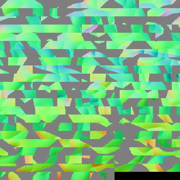


要生成每个图块的像素，我们需要从两个来源访问 SDF 数据：

-     
    程序生成器
-     
    在 LOD 0 处编辑的体素


一种经典的方法用于获得法线：在所需位置，我们取 4 个样本偏移一小步，计算它们的差异，并对结果进行归一化。它被称为“前向差分”（参见Inigo Quilez关于SDF法线的文章）。


由于每个网格都有自己的纹理，因此另一种派上用场的技术是八面体压缩。这些法线是世界空间，在纹理中编码它们需要每个像素 3 个字节（对于 X、Y、Z）。使用八面体压缩，我们牺牲了一些质量，以获得每像素 2 个字节的更小尺寸。

### 在 GPU 上渲染


此功能非常昂贵，因此如果它支持 Vulkan，则可以在显卡上运行它。可通过选中 `run on GPU` 地形检查器来启用此功能。

 局限性：

-     
    GPU 法线贴图目前不支持编辑的体素。编辑的区域将使用 CPU 回退。
-     
    您使用的生成器必须支持 GLSL 的着色器变体。 `VoxelGeneratorGraph` 是目前唯一支持它的人。它的某些节点不支持它。
