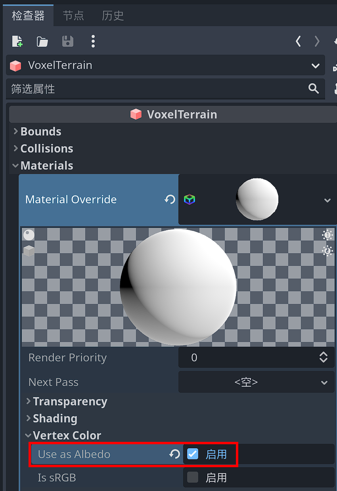
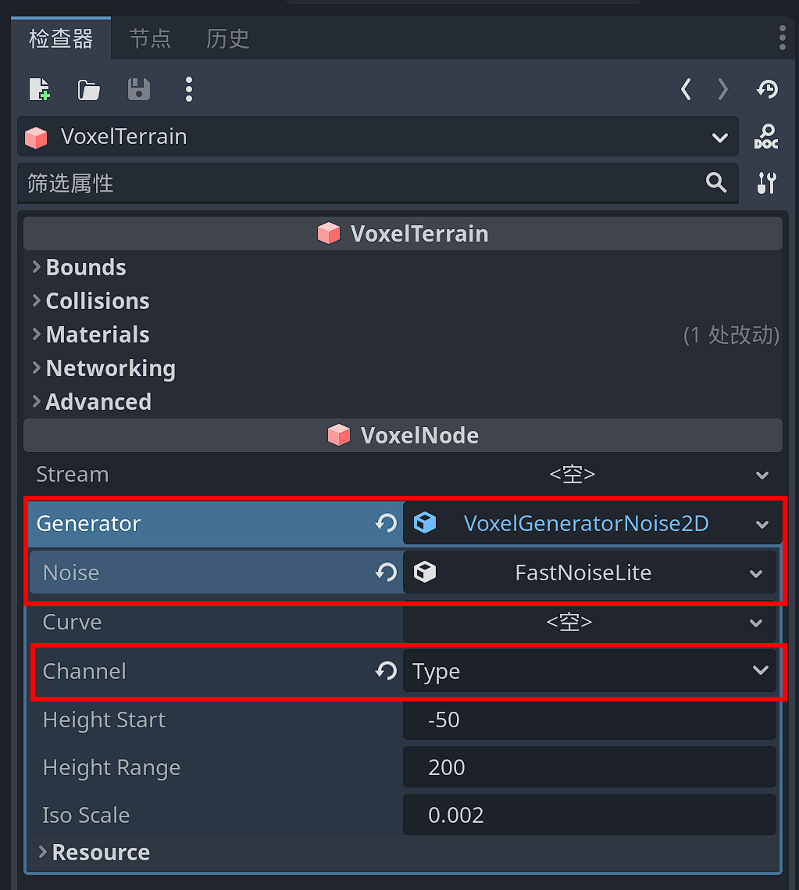
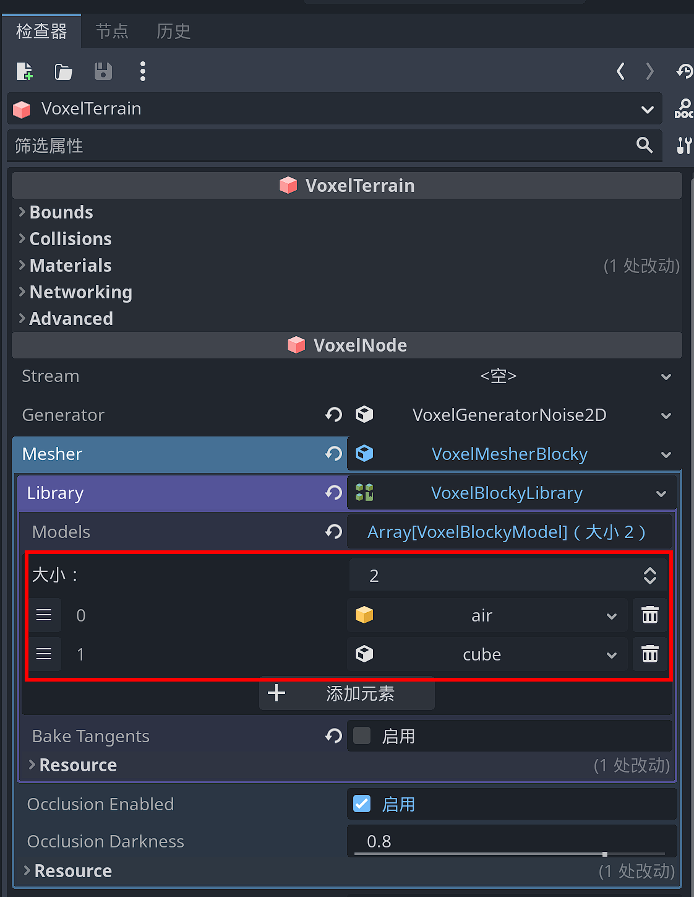
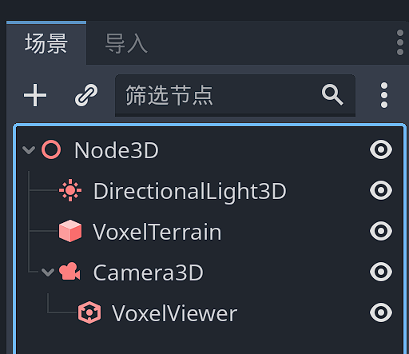
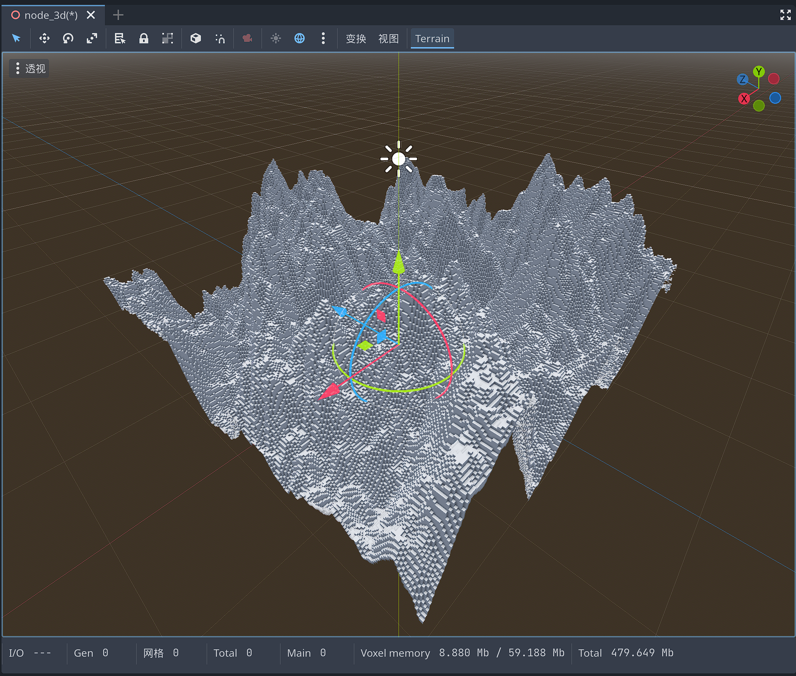
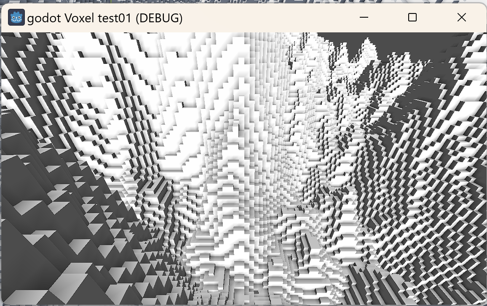
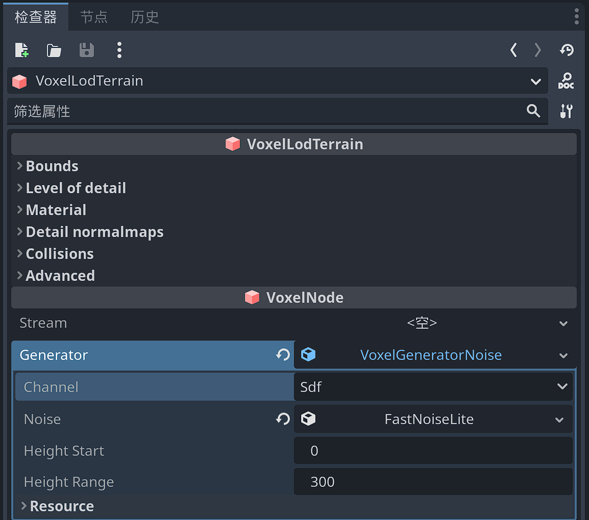
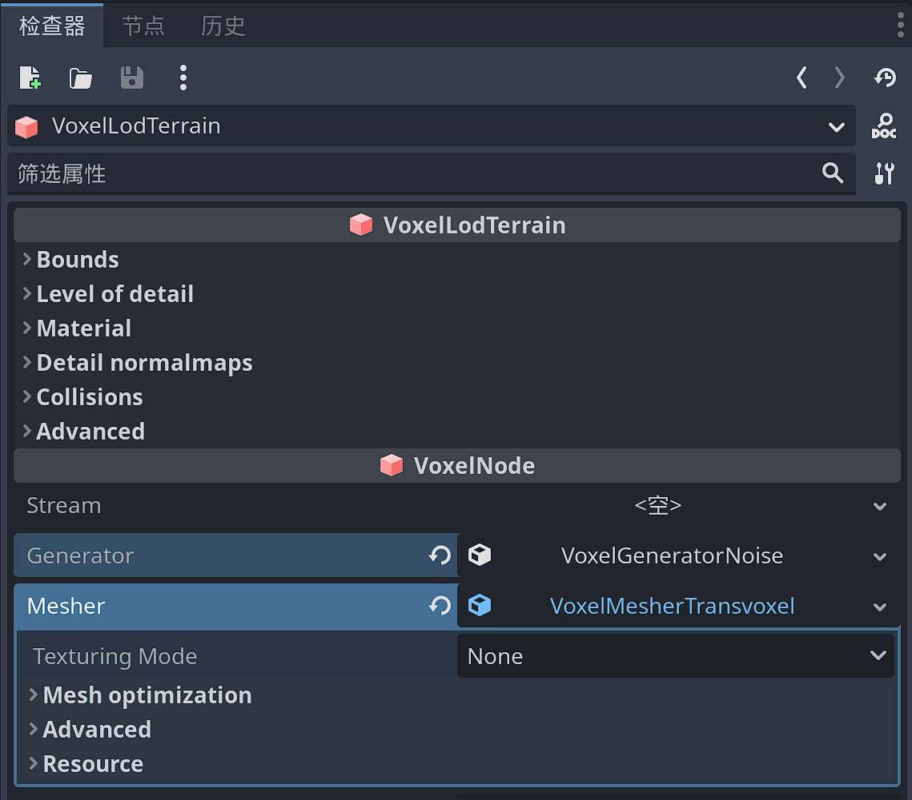
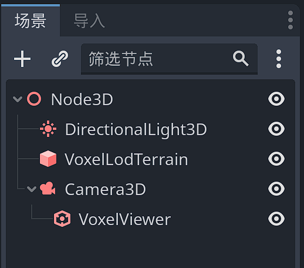
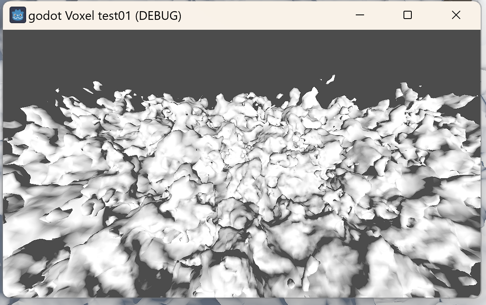

# 快速上手

##  简短食谱

以下部分包含运行体素地形的基本快速入门说明。有关更深入的信息，请参阅文档的其余部分。

在每个示例之前，您可以执行以下操作：

-     
    创建新项目和新的 3D 场景。通过添加一个 `DirectionalLight` 节点给它一些光，并定向它，使其大致向下发光。您也可以启用 `Shadows` 。

## 块状高度图地形使用 `VoxelTerrain`

1） 添加 `VoxelTerrain` 节点，并在检查器中调整以下设置：

1.1）在该 `materials` 部分下，在第一个插槽中创建一个新 `StandardMaterial3D` 插槽。单击该材质，然后在“顶点颜色”类别中，启用“用作反照率”（ `vertex_color_as_albedo` ）。这将使块具有更好的阴影效果。

1.1）单击 `Generator` 属性：创建一个新的 `VoxelGeneratorNoise2D` .然后单击它并将其 `Channel` 参数设置为 `TYPE` .此外，请确保将 `noise` 属性分配给噪声资源。

1.2）找到 `Mesher` 属性：新建一个 `VoxelMesherBlocky` 资源。在其 `library` 属性中，新建一个 `VoxelBlockyLibrary` 资源。设置size为`2` ，添加两个插槽。在第一个插槽中，新建一个 `VoxelBlockyModel` 资源，重命名为`air`。在第二个插槽中，新建一个 `VoxelBlockyModelCube` 资源，重命名为`cube` 。

1.3）再次选择地形节点，在视口顶部的 `Terrain` 菜单中，单击 `Re-generate` （也就是“重新生成”）。

2）但是体素地形网格并没有正确生成，因为它还需要一些额外的设置。为场景添加一个 `Camera3D` 节点，并将其提升到地形上方。您可能还想将其向下倾斜一点，以查看更多的景观。

3） 在`Camera3D` 节点上添加一个 `VoxelViewer` 子节点。游戏运行时，当摄像机四处移动时，这个节点将告诉体素引擎在何处生成体素。

此时重新点击视口顶部 `Terrain` 菜单中的 `Re-generate` ，将可以看到视口中正确生成了体素网格。

4）或者运行场景：你也应该可以看到地形出现！

您可以通过更改发生器下的噪声参数来修改地形的形状。

`VoxelMesherBlocky` 允许指定不仅仅是白色立方体的方式：您可以定义多个模型，具有不同的纹理，材料和形状，以便组成一个世界，例如您在Minecraft中看到的那样。

## 使用 `VoxelLODTerrain` 悬垂大型平滑高度图

1） 添加 `VoxelLODTerrain` 节点，并在检查器中调整以下设置：

1.1）： `Generator` 创建一个新的 `VoxelGeneratorNoise` .然后单击它并将其 `Channel` 参数设置为 `SDF` .此外，请确保将 `noise` 属性分配给噪声资源。

1.2）： `Mesher` 创建一个新的 `VoxelMesherTransvoxel` .

2） 此时，您应该开始在编辑器视口中看到一个平滑的海绵状地形。如果看不到任何内容，可以通过重新打开场景或使用菜单 `Terrain -> Re-generate` 强制重新加载。

3）地形尚未设置为在游戏中出现，因此需要一些额外的设置。添加一个 `Camera3D` 节点，并将其提升到地形上方。您可能还想将其向下倾斜一点，以查看更多的景观。

4） 在相机下方添加一个 `VoxelViewer` 节点。当游戏运行时，当摄像机四处移动时，此节点将告诉体素引擎在何处生成体素。

5）播放场景：你应该看到地形出现！

您可以通过更改发生器下的噪声参数来修改地形的形状。

尚不支持手动绘制纹理，但可以使用着色器应用程序纹理。

很容易认为一个项目需要体素，但它们并不像听起来那么需要。以下是您可能认为需要体素以及为什么可能不需要它们的一些原因：

-     
    “我需要一个程序生成的世界”：如果你不需要悬垂，你可以使用高度图方法。高度图更快、更易于使用。
    
-     
    “我需要可破坏的模型”：此模块中的体素是“blobby”或“块状”，它们不能代表所有可能的形状。如果您需要精确的东西，您可以尝试更专业的替代方案，例如 CSG 节点或预先计算的销毁。
    
-     
    “我需要一个有悬垂和洞穴的地形”：你需要它被玩家编辑吗？如果没有，那么您可以在任何 3D 建模器中对地形进行建模并提前对其进行优化。您可以混合高度图 + 3D 模型。您可能依靠体素来简化创作过程，但在导出的游戏中，您只需要网格和静态碰撞体。
    
-     
    “我需要制造一颗行星”：您可以通过将 6 个球形高度图拼接在一起来制作更高效的行星。拿一个立方体，其中每个面都是一个高度图，然后吹起该立方体将其变成一个球体。
    
-     
    “网格图很糟糕”：您希望网格有多大？您的模型有多复杂？该模块的块状网格器面向具有简单几何形状的非常大的网格，因此它有自己的限制。
