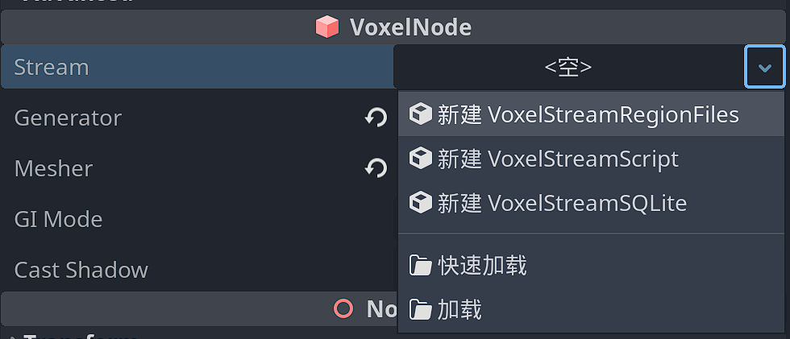

# 流(Streams) 

## 概述

`VoxelStream` 是流类型的基，允许使用各种实现将体素数据保存和加载到文件或目录结构中。实际的流类型包括：VoxelStreamRegionFiles ,   VoxelStreamSQLite ,   VoxelStreamScript。

- `VoxelStreamRegionFiles` 是一个较旧的，其工作原理类似于Minecraft的区域系统。它保存在一个文件夹中的多个文件下。仅支持体素数据。
- `VoxelStreamSQLite` 是功能最强的一个，使用单个 SQLite 数据库文件保存体素数据。

- `VoxelStreamScript` 是可以使用脚本实现的自定义流。请参阅脚本。

目前没有使用现有文件格式（例如 `.vox` ）的流实现，主要是因为当前的 API 希望能够以与引擎格式兼容的块加载数据。

## 使用流进行游戏的保存

创建流最初是为了用作保存体素数据。对地形使用体素技术的游戏通常是永久性的，因此磁盘上必须有一个位置来保存更改，然后重新加载它们。

Godot Voxel可以处理近乎无限的地形大小，因此经常存在无法将整个世界加载到内存中的情况。而流则是逐块（block或chunks）提供数据。只有玩家附近的方块才会加载到内存中。当玩家移动时，远处的方块将被卸载/保存，而越来越近的方块将被加载。

默认情况下，仅保存修改后的块。但是，如果您使用的生成器太昂贵而无法按需重新运行，则可以对其进行配置，以便始终保存每个新块。《我的世界》就是这种情况。

编辑体素时，修改后的块不会立即保存。这是因为许多编辑可能会不断发生，并且尝试过于频繁地保存可能会浪费。

仅在以下情况下进行保存：

-     
    距离太远时块被卸载
-     `save_modified_blocks()` 在地形节点上调用（您可能希望在玩家保存或退出游戏时调用此节点）

## 在Godot编辑器中使用流

目前，流可以在Godot编辑器中运行，但它们的行为与游戏正在运行的行为相同。如果您修改任何内容，块最终将在与前面相同的条件下保存。如果要保留游戏存档，请保留未分配 `stream` 的属性，也可以在编辑器中为流分配“开发存档”。然后，从游戏中分配与实际存档不同的路径（使用脚本）。

如果您在游戏和编辑器之间使用相同的存档文件，则在运行游戏时存在冲突的风险：它将尝试打开编辑器已经打开和锁定的文件。若要解决此问题，请使用其他文件，或在运行游戏之前关闭场景。请参阅问题 283。

## 保存格式规范

-    [区域格式](https://voxel-tools.readthedocs.io/en/latest/specs/region_format_v3/)
-    [块格式](https://voxel-tools.readthedocs.io/en/latest/specs/block_format_v2/)
-    [SQLite 格式](https://voxel-tools.readthedocs.io/en/latest/specs/sqlite_format/)
