# 生成器（Generator）

`VoxelGenerator` 是所有体素生成器的基类，具体的生成器包括：VoxelGeneratorFlat ,   VoxelGeneratorWaves，VoxelGeneratorImage，VoxelGeneratorNoise2D，VoxelGeneratorNoise , VoxelGeneratorGraph， VoxelGeneratorScript。

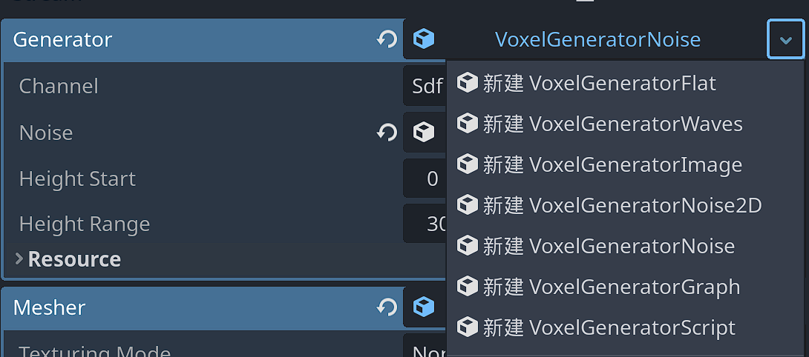

`VoxelGenerator` 允许在空间中给定特定区域或从单个位置生成体素。它们可以作为自动创建大型场景的基础，也可以用于游戏中生成世界。它们占有重要地位，因为存储体素数据很昂贵，而程序源是轻量级的。

##  生成器如何工作

生成器目前在 CPU 上运行，主要在体素块上工作。例如，给定 `VoxelBuffer` 16x16x16 个体素，他们决定每个体素将采用什么值。使用块可以更轻松地将工作拆分到多个线程中，并且只关注玩家所在的区域，尤其是在世界无限的情况下。

体素数据分为不同的通道，因此根据要生成的体积类型，将使用一个或多个不同的通道。例如，Minecraft 生成器可能会将 `TYPE` 通道用于体素类型，而平滑地形生成器将使用 `SDF` 通道填充距离字段值。

生成器具有线程安全的 API。同一个生成器 `generate_block` 方法可以同时由多个线程使用。但是，根据类的不同，某些参数可能只能从主线程修改，因此请查看文档以确保。

如果没有为体积提供生成器，则默认情况下将用空气填充块。

##  基础生成器

Godot Voxcel提供了几个内置生成器。它们是获得快速结果的简单示例，并展示了如何实现基本 API（请参阅源代码）。

其中一些生成器可以选择它们将在哪个频道上工作。如果使用平滑网格划分器，请使用 `SDF` 通道 （1），否则使用`TYPE` 通道 （0）。

以下屏幕截图使用平滑的  `VoxelLodTerrain` 。

| 生成器类型            | 检视器面板属性                                               | 生成地形                                                     |
| --------------------- | ------------------------------------------------------------ | ------------------------------------------------------------ |
| VoxelGeneratorFlat    | 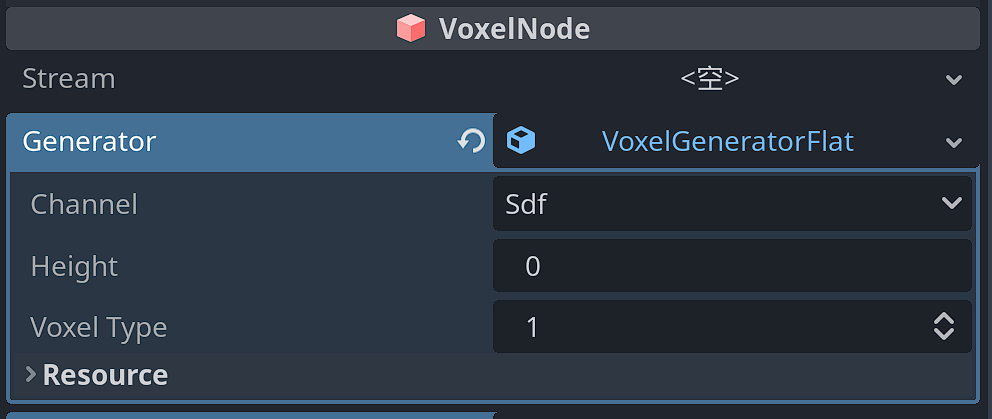 | 生成平面地形。  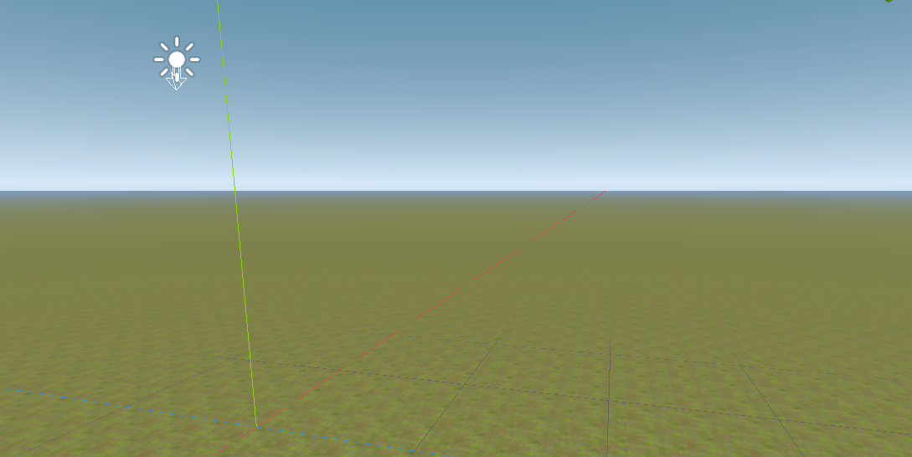 |
| VoxelGeneratorWaves   | 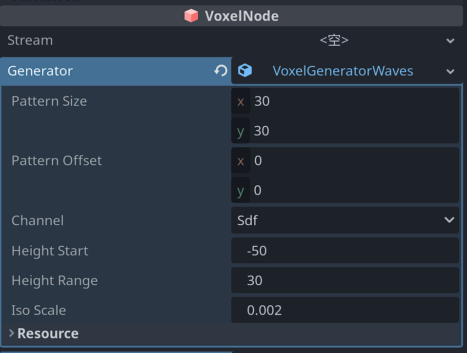 | 生成波浪地形。 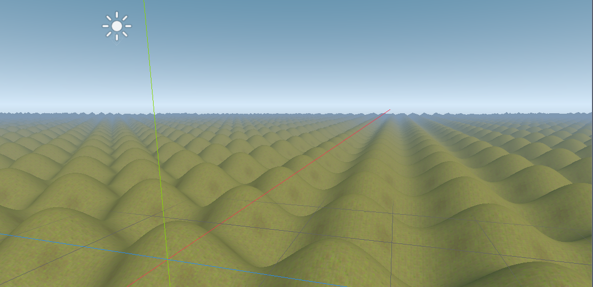 |
| VoxelGeneratorImage   | 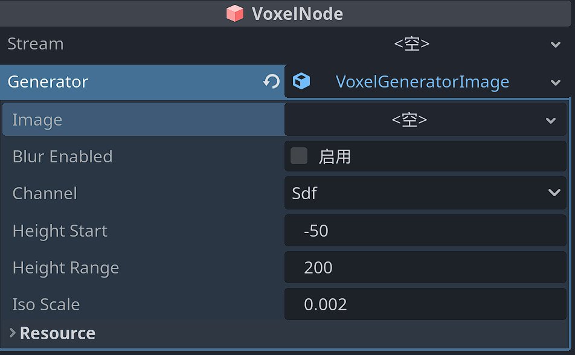 | 基于图像生成高度图，无限重复。 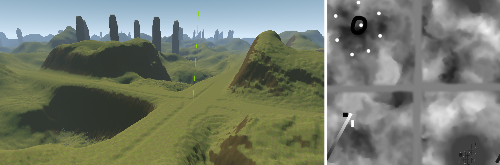 |
| VoxelGeneratorNoise2D | 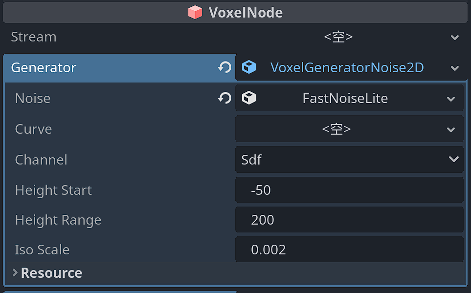 | 基于分形噪声生成高度贴图。 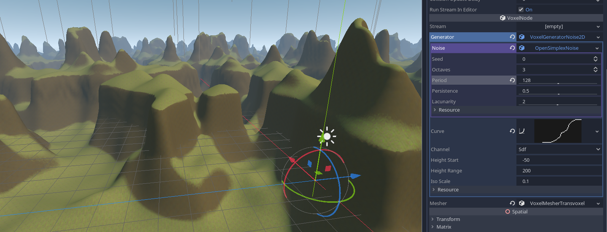 |
| VoxelGeneratorNoise   | 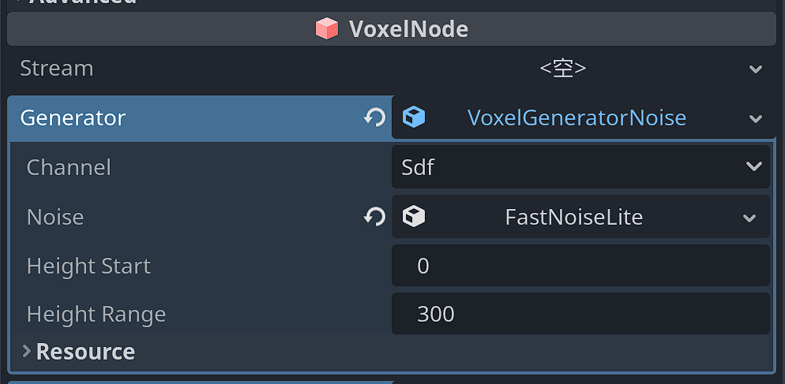 | 使用 3D 分形噪声生成具有悬垂的斑点地形。沿高度应用渐变，因此体积在上升时变成空气，并在下降时关闭成物质。 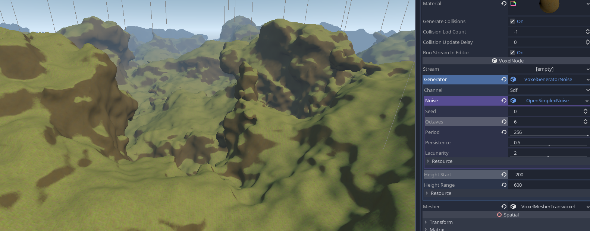 |
| VoxelGeneratorGraph   | 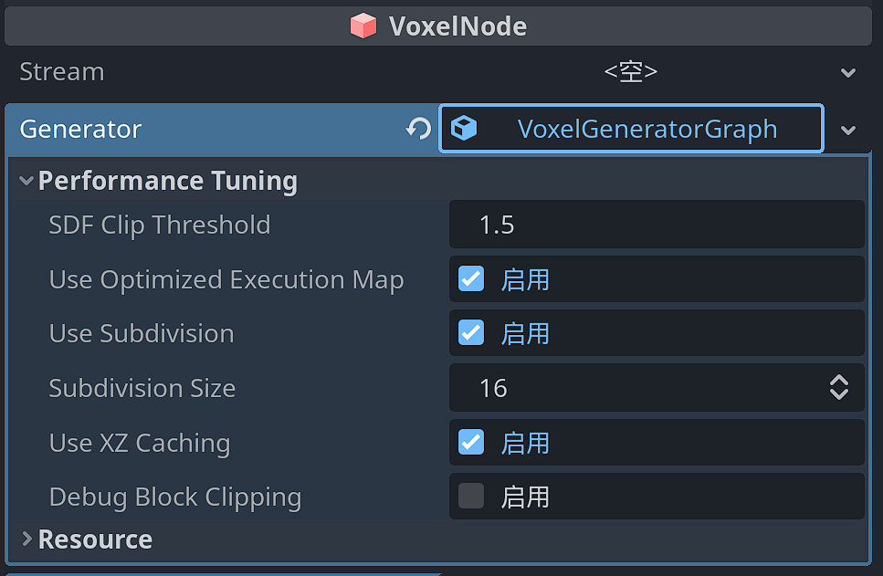 | 节点图形式的生成器。 具体可参考： [VoxelGeneratorGraph节点](VoxelGeneratorGraph节点.md)  和[VoxelGeneratorGraph详细使用](VoxelGeneratorGraph详细使用.md) 。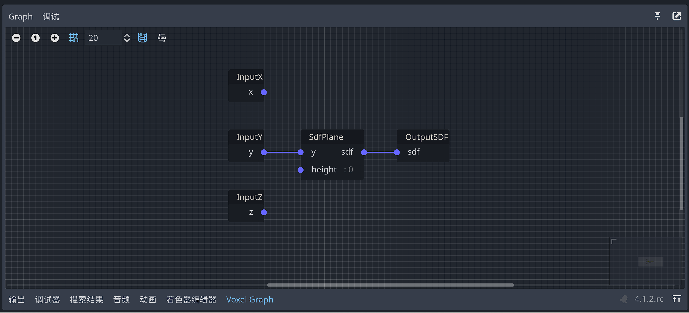 |
| VoxelGeneratorScript  |                                                              | 自定义生成器。                                               |

